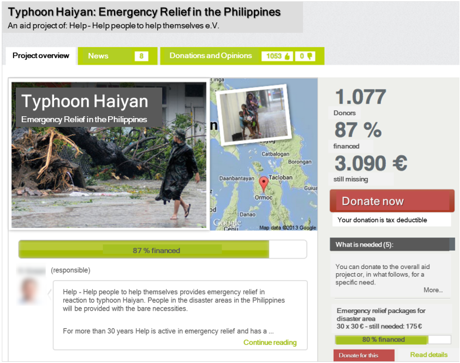
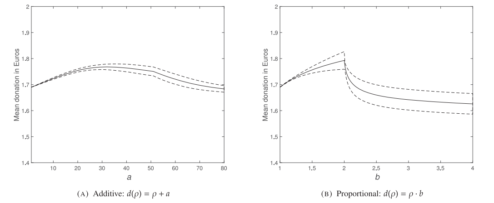

```{r 'check_ps', include=FALSE}

user.name = 'ENTER A USER NAME HERE'
```


# The Effects of Defaults on Donations

Author: Stefanie Buda


<style>
.shiny-input-checkboxgroup  {
  width: 80% !important;
}
</style>


## Exercise Welcome!

Welcome to this interactive problem set which is part of my master's thesis at Ulm University. Together we will retrace the findings of the article "Defaults and donations: Evidence from a field experiment" by Steffen Altmann, Armin Falk, Paul Heidhues, Rajshri Jayaraman and Marrit Teirlinck. We will have a deeper insight into the statistical methods used as well as how R can help us perform those analyses ourselves. 

The article can be found [here](https://direct.mit.edu/rest/article-abstract/101/5/808/58537/Defaults-and-Donations-Evidence-from-a-Field?redirectedFrom=fulltext). If you are also interested in the data set provided by the authors you can be download it  [here](https://dataverse.harvard.edu/dataset.xhtml?persistentId=doi:10.7910/DVN/DHKQ7B). 


The authors explore an approach for online fundraising websites to help them increase their donation revenues. I don't want to spoil too much because I want you to go into this problem set as unbiased as possible.  


The problem set is published on the following websites:

- `GitHub`:  https://github.com/StefanieBuda/RTutorDefaultsAndDonations

- `shinyapps.io`: https://stefaniebuda.shinyapps.io/RTutorDefaultsAndDonations/


### Content 

Here's a brief overview of the exercises you will be working on: 

**Exercise 1: Setting**

**Exercise 2: Exploring our Data**

**Exercise 3: Descriptive Approach**

Exercise 3.1: Do defaults affect individual donor behavior?

Exercise 3.2: Do defaults affect donation and co-donation levels? 

**Exercise 4: Statistical Analysis**

Exercise 4.1: Theoretical Background

Exercise 4.2: Conducting the Analysis

**Exercise 5: Personalized Defaults**

Exercise 5.1: A Simple Model of As-if Costs

Exercise 5.2: Model Estimation

**Conclusion**

**References**

**Appendix**

A.1: Compute the varying bandwidth

A.2: Compute the log-likelihood function


### How to solve this problem set

This problem set consists mainly of code chunks for programming tasks, but some tasks also consist of quizzes. Those quizzes can be single choice, multiple choice or even require your input. You do not have to solve the exercises in the given order, but I would highly recommend doing so since the later exercises are based on results of the prior ones. Within one exercise you have to solve the tasks in the given order.

When working on a programming task, you can see several buttons above the code chunks. The button *edit* lets you edit the code inside of the chunk in case it's not editable yet. Click *check* to check your answer, if you're not sure what to do next or why your solution is not correct, you can click *hint* to get a clue. A click on *solution* reveals the sample solution.

For the quizzes, just choose the correct answer(s) or enter the solution in the blank field and click *check*.

To move on to the next exercise, you can use the "Go to next exercise" button on the bottom left or click on the respective tabs on top.


For successfully solving the exercises you can earn awards during the course of this problem set. I hope this pushes your motivation even further, because you want to collect them all, right? Now let's get started with solving this problem set and most importantly: Have fun!


## Exercise 1 -- Setting

First of all we want you to get familiar with the setting and give you a sneak peek of the experiment that was performed to answer the research questions. Please imagine the following situation:

You are browsing the website of a donation platform looking at different projects asking for your support of a good cause. The project you are currently looking at is collecting donations for emergency relief in the Philippines. There's a description of the project and you can see that the organizers have already collected 87% of the required amount. The website looks like this:




*This picture is a screenshot taken of Figure B.1 (Online Appendix).*

You decide to make a donation to this project. Additionally to the donated amount in favor of the project, you can also support the website with a separate donation by choosing a specific percentage of your original donation that will be added on top. Please take a moment to think about your personal choice for both of these values before solving the first task below. 


**Task 1.1** Now that you have thought about it, please enter your donated amount in Euro in the chunk below. You can change the preset value. Then please click *check* to proceed. 

```{r "2_1"}
# Your donated amount in favor of the project in Euro. 

your_donation = 20
```


**Task 1.2** This time please enter your donated percentage to support the website in the chunk below. You can change the preset value. To complete this task, please click *check*.

```{r "2_2"}
# Your donated amount in favor of the website in percent.

your_codonation = 10
```


**Task 1.3** The following chunk calculates your total donation based on your inputs from above. Just click *check* to have a look at it. 

```{r "2_3"}
total_donation = your_donation + (your_donation * your_codonation/100)

total_donation
```

That's basically the core donation process that the authors observed for their experiment. From June 8, 2012 to April 19, 2013 they observed the visitors of [betterplace.org](https://www.betterplace.org), including both those just browsing the websites without making a donation and those actually making a donation. The preset value as we called it above is also called a **default**. In our case it's the values filled in previously for the donation and add-on donation (which we will call co-donation) that **can be changed** freely. So by varying the default values presented to the potential donors on the website the authors want to analyze potential effects of defaults.

There are **four** different default values for the donations: 0€, 10€, 20€ and 50€. For the co-donations there are **three** different default values: 5%, 10% and 15%. The 0€ default for donation represents the absence of a default, which we also call the **active-decision (AD)** environment. 5% of co-donation is what the platform originally used as a default, so this default is like a "control group" for the time before the intervention.


**Task 1.4** Since every person is facing the defaults in both dimensions, our treatments are defined by the combination of both of them.


Quiz: How many different treatments do we have?

[1]: 7
[2]: 12 
[3]: 4

```{r eval=FALSE}
# Run line to answer the quiz above
answer.quiz("Treatment_design")
```

We have a 4 $\times$ 3 design, therefore there are twelve different treatments in total. Those treatments were assigned to a user on the first visit of a donation page and kept constant using a browser cookie to make sure one user stays in the same treatment group. Another thing worth mentioning is that the experiment only included projects with a remaining required budget of at least 50€ to make sure that the highest possible default of 50€ is actually possible to be donated. 

Like this, the authors collected a lot of data on website visitors and their behavior which we can analyze in the following exercises.

Now last but not least, let's get back to your choice from the beginning of this exercise - how did you react to the defaults presented in the code chunks?


**Task 1.5** Did you stick to the default values or did you make changes to the preset value? Run the following chunk (via *check*) to refresh your memory. 

```{r "2_4"}
ifelse(your_donation == 20 & your_codonation == 10, "You stuck to the default in both dimensions!",
       ifelse(your_donation == 20 & your_codonation != 10, "You stuck to the default only for the donation!",
       ifelse(your_donation != 20 & your_codonation == 10, "You stuck to the default only for the co-donation!",
              "You changed the given default value for both dimensions!")))
```


## Exercise 2 -- Exploring our Data

In this exercise we will have a first look at our data set. The original data set the authors provide can be found [here](https://dataverse.harvard.edu/dataset.xhtml?persistentId=doi:10.7910/DVN/DHKQ7B), but the file we will use in this problem set is a pre-processed version of it which is called `DefaultsAndDonations.dta`. Among other things I removed some columns we won't need for our analysis. You can take a look at the data preparation file if you're interested in the exact changes I made. 


**Task 2.1** First of all, we need to consider the file format of our data set. It is a Stata DTA file, therefore we need a command from a special package to be able to import it. You can load a package by using `library(package_name)`. In this case, we need the package called `haven`. Now it's your task to replace the blank shown below with the correct command. 

```{r "3_1"}
___(haven)
```


**Task 2.2** Now we can import our file and assign it to a variable. In R, we assign data to a variable using `name_of_variable <- data_set`. The command mentioned above is `read_dta("file_name")`. Again, replace the blanks below to assign our data set to a variable called `data`.

```{r "3_2"}
___ <- ___("DefaultsAndDonations.dta")
```


**Task 2.3** Let's have a first look at our data. We can use the command `head(data_name)` to display the first few rows of our data. The columns represent the variables we can use for our analysis. Just click *check* to run the code.

```{r "3_3"}
head(data)
```


These variables are defined as follows:

- `session_id`: ID of the website session

- `default_donation`: assigned default donation in Euro

- `default_codonation`: assigned default co-donation in percent

- `treat`: assigned treatment labelled as (d€,c%) with default donation in d€ and default co-donation in c%

- `donate`: dummy variable for making a donation (1 for donating, 0 for not donating)

- `codonate`: dummy variable for making a co-donation (1 for co-donating, 0 for not co-donating)

- `donated_amount`: donated amount in Euro

- `codonated_amount`: co-donated amount in Euro

- `codonated_pct`: co-donation in percent of donation

- `num_donations`: number of donations made within the website session


**Task 2.4** One row corresponds to one observation, defined by the variables described above.


Quiz: What is one observation?

[1]: a donation
[2]: a website visit 
[3]: a project

```{r eval=FALSE}
# Run line to answer the quiz above
answer.quiz("Observation")
```


**Task 2.5** Now we want to know how many observations our data set contains. We can use the command `nrow(data_set)` to achieve this by counting the rows in our data frame. Please enter the code needed in the chunk below.   

```{r "3_4"}
# Enter your code here.
```

Our data set contains 683,910 visits of the website, that's quite a lot! Additionally, in most oft the cases (in 99.7%, to be exact) the session ID is unique, which means that those observations correspond to a unique website visitor.


**Task 2.6** In the previous task we learned that there are a lot of visits of the website, but not all of them end with a donation. In this task we want to calculate the total number of donation, which can easily be done by using our variable `donate`. Since it's a dummy variable (only 1 or 0), we can just add it up for all observations. We can access a specific column of a data set by using `data_set$column`. Please fill in the blanks with the correct names.

```{r "3_5"}
sum(___$___)
```

So after all, out of those over 680,000 visits, only 22,792 actually end up making a donation. 


**Task 2.7** Since we have information on that many people, I bet you are curious about how much money we're talking here. You can calculate the total sum of donations using the code in the next chunk. We want to sum up the donated amount in euro of all observations. You already know what to do - please fill in the blanks. 

```{r "3_6"}
___(data$___)
```

This means the authors collected data on over 680,000 visits, of which almost 23,000 resulted into the visitor actually making a donation, adding up to the astonishing value of 1.17 million euro! 


Now that we have a general understanding of our data, let's have a look at some summary statistics for our treatments to see if there are any bigger discrepancies.


**Task 2.8** Before we get started with setting up those summary statistics, we have to make a small adjustment to one of our variables. We should transform our variable `treat` into a factor variable in order to be able to change the order of the treatments (in which they will show up in a table or plot). To be able to use the command `fct_relevel` to do so, we need to load the package `forcats` first. Additionally, we need the package `dplyr`. Again, I left you some blanks that want to be filled in the chunk below. 

```{r "3_7"}
___(forcats)
___(dplyr)

data <- data %>% 
  mutate(treat = as.factor(treat)) %>%
  mutate(treat = ___(treat, 
                           c("(AD,5)", "(AD,10)", "(AD,15)", "(10,5)","(10,10)", "(10,15)", "(20,5)", "(20,10)", "(20,15)", "(50,5)", "(50,10)", "(50,15)"))) 
```


```{r eval=FALSE}
# Run for additional info in the Viewer pane
info("Pipe operator %>%")
```


**Task 2.9** Now we need to calculate the statistics we want to show. For that, we create the variable `sum_stats`. First of all we use the command `group_by()` to group our data according to our treatments. Then we can use `summarize()` to calculate the statistics per treatment, whereat all of them are averages. Please fill in the blanks using this description and the given parts of the code.    

```{r "3_8"}
___ <- data %>% 
  ___(treat) %>%
  summarize(donation_rate = mean(donate)*100,
            av_donation_all = ___(donated_amount),
            av_donation = mean(donated_amount[donate == 1]),
            av_codonrate_all = mean(codonate)*100,
            av_codonrate = mean(codonate[donate == 1])*100,
            av_codon_all = mean(codonated_amount),
            av_codon = mean(codonated_amount[donate == 1]))
```


**Task 2.10** Currently, our data frame displays the treatments as rows and the statistics as columns. We want this to be the other way round, so we use the following code to transpose our data frame to swap rows and columns. Additionally, we rename them. Click *check* to run the chunk.  

```{r "3_9"}
sum_stats_t <- sum_stats[-1] %>% t() %>% as.data.frame()

colnames(sum_stats_t) <- c("(AD,5)", "(AD,10)", "(AD,15)", "(10,5)","(10,10)", "(10,15)", "(20,5)", "(20,10)", "(20,15)", "(50,5)", "(50,10)", "(50,15)")
rownames(sum_stats_t) <- c("Donation rate (%)", "Av. donation (overall)", "Av. donation (donors only)", "Co-Donation rate (%, all)", 
                           "Co-Donation rate (%, donors only)", "Av. co-donation (€, all)", "Av. co-donation (€, donors only)")
```


**Task 2.11** Last but not least, we want to display our table in a neat fashion. For that, we use the package `kableExtra` and its command `kbl()`. The code to load the package and create the table is already given, please click *check*.

```{r "3_10"}
library(kableExtra)

sum_stats_t %>%
  kbl(col.names = c("(AD,5)", "(AD,10)", "(AD,15)", "(10,5)","(10,10)", "(10,15)", "(20,5)", "(20,10)", "(20,15)", "(50,5)", "(50,10)", "(50,15)"), 
      align = "c", digits = 2, format = "html", caption = "Summary Statistics") %>%
  add_header_above(c(" ", "Treatment (d€, c%)" = 12)) %>%
  kable_styling(bootstrap_options = c("striped", "condensed")) %>%
  pack_rows("Donations", 1, 3) %>%
  pack_rows("Codonations", 4, 7)
```

*This table references rows (1)-(3) and (5)-(8) of Table A.1.*


The donation rate (the fraction of participants who make a donation) is a bit over 3% for all the treatments. This may seem quite low, but according to the platform providers, this matches with historical levels of the donation rate they observed. The average donation overall ranges between 1.54€ and 1.85€. Again this seems quite low, but it's no wonder since it's directly caused by the low donation rate. The average donation however is quite remarkable: on average, every donor donates about 50€! 

The co-donation rate is similarly low to the donation rate when we include all of our observations, but if we only include donors, it's above 50% for all treatments. This means that on average half of our donors also make a co-donation. The average co-donation overall and for donors only show a similar discrepancy as the average donations above. For all observations it is relatively small and ranges between 0.04€ and 0.09€. For donors only it ranges between 1.26€ and 2.80€. 


Just by looking at this table our treatments seem to be pretty balanced, there is no specific trend we can see at first glance. That's our task for exercise 3: Analyze our data further and find effects using a descriptive approach.


## Exercise 3 -- Descriptive Approach

Now we want to analyze our data using tables and graphs to answer our two main questions: 

1) Do defaults affect **individual behavior**?  

2) Do defaults influence **overall donation** revenues?


## Exercise 3.1 -- Do defaults affect individual donor behavior?

We will start with examining the potential effects of the default donation level on the donated amount and those of the default co-donation level on the co-donated amount in percent. We want to take a look at the numbers presented in a table.


First of all we need to reload our data in order to be able to access it. Just click *edit* and *check*.

```{r "5_1"}
data <- read_dta("DefaultsAndDonations.dta") %>% 
        mutate(treat = as.factor(treat)) %>%
        mutate(treat = fct_relevel(treat, 
                                  c("(AD,5)", "(AD,10)", "(AD,15)", "(10,5)","(10,10)", "(10,15)", "(20,5)", "(20,10)", "(20,15)", "(50,5)", 
                                    "(50,10)", "(50,15)"))) 
```


In case you need to refresh your memory on the variables we have, here's an additional info box you can always come back to. 


```{r eval=FALSE}
# Run for additional info in the Viewer pane
info("Variables in our data set")
```


**Task 3.1.1** We want to analyze how many donors exactly donated 10€, 20€, 50€ or a different amount respectively co-donated 0, 5%, 10%, 15% or a different amount. To make things easier for us, we create a new data set `data_groups` which only contains those who actually made a donation and add new dummy columns for those categories mentioned before. To do this, we use the commands `mutate()` and `ifelse(test, yes, no)`. Please fill in the gaps.

```{r "5_2"}
___ <- data %>%
  filter(___ == 1) %>%
  # dummies for donations
  mutate(group10 = ifelse(donated_amount == ___,1,0),
         group20 = ifelse(donated_amount == ___,1,0),
         group50 = ifelse(donated_amount == ___,1,0),
         groupOther = ifelse(!(donated_amount %in% c(10, 20, 50)),1,0)) %>%
  # dummies for co-donations
  mutate(group0p = ifelse(codonated_pct == 0,1,0),
         group5p = ifelse(codonated_pct == 5,1,0),
         group10p = ifelse(codonated_pct == 10,1,0),
         group15p = ifelse(codonated_pct == 15,1,0),
         groupOtherp = ifelse(!(codonated_pct %in% c(0, 5, 10, 15)),1,0))
```


**Task 3.1.2** Now we can use those dummy columns for our calculations. We can use the command `group_by(column)` and `summarize()` to calculate metrics for one or more variables. In our case, we want to calculate the proportion of donors per treatment. Please fill in the blanks in the chunk below. The second part of the chunk transposes the newly created data frame to fit the layout we want to have later on.

```{r "5_3"}
# Create data frame
data_panelA <- data_groups %>%
               group_by(___) %>%
               ___(frac10 = sum(___)/n(), frac20 = sum(group20)/n(), frac50 = sum(group50)/n(), fracOther = sum(groupOther)/n())

# Tanspose data frame
panelA <- data_panelA[-1] %>% t() %>% as.data.frame()
colnames(panelA) <- c("(AD,5)", "(AD,10)", "(AD,15)", "(10,5)","(10,10)", "(10,15)", "(20,5)", "(20,10)", "(20,15)", "(50,5)", "(50,10)", "(50,15)")
rownames(panelA) <- c("€10", "€20", "€50", "Other")
```


**Task 3.1.3** Once again, we want to use the command `kbl()` to present our data set in a nicely structured table. Additionally, we want to move the columns containing the AD treatments to the end. To achieve this, we can use the command `relocate()`. Your task is to fill in the three missing terms.   

```{r "5_4"}
___ %>%
  ___("(AD,5)", .after = last_col()) %>%
  relocate("(AD,10)", .after = last_col()) %>%
  relocate("(AD,15)", .after = last_col()) %>%
  ___(col.names = c("(10,5)","(10,10)", "(10,15)", "(20,5)", "(20,10)", "(20,15)", "(50,5)", "(50,10)", "(50,15)", "(AD,5)", "(AD,10)", "(AD,15)"), 
      align = "c", digits = 3, format = "html", caption = "Donations by Treatment") %>%
  add_header_above(c("Amount", "Treatment (d€, c%)" = 12)) %>%
  kable_styling(bootstrap_options = c("striped", "condensed", "hover")) %>%
  column_spec(c(4,7,10), border_right = T)
```

*This table references the upper part (Panel A) of Table 1.*


**Task 3.1.4** Please take a look at the table above. 


Quiz: Is there an effect on individual donations?

[1]: yes 
[2]: no

```{r eval=FALSE}
# Run line to answer the quiz above
answer.quiz("Effect_of_defaults_on_Donations")
```

The table shows a strong impact of the defaults on individual donations. The proportion of donors donating exactly the default amount is much higher than for the other amounts. If you take a look at the first row you can see that 22.9%, 22.8% and 21.7% of donors actually donate 10€ when it was used as the default donation value (columns 1-3), whereas only 12.4% to 13.9% of donors make a donation of 10€ when they were facing a different default level (columns 4-9). Even in our active decision environment, which is our baseline, only 14.6% to 17.3%	of donors donate an amount of 10€ overall. Hence we can also say that the default also increased the likelihood of donating 10€ compared to a default-free setting. These findings also apply to the second and third row. Additionally, if you look at each column separately, the highest proportion of donors is also always donating the default compared to the other amounts. 


**Task 3.1.5** Now we want to create the same type of table for the co-donations using `data_panelB` and `panelB`. Since you've already seen how it works, this time I left you a couple more blanks to fill in.

```{r "5_5"}
# Create data frame
___ <- ___ %>%
               ___(treat) %>%
               summarize(frac0p = sum(___)/n(), frac5p = sum(___)/n(), frac10p = sum(___)/n(), frac15p = sum(group15p)/n(), 
                         fracOtherp = sum(groupOtherp)/n())

# Tanspose data frame
panelB <- data_panelB[-1] %>% t() %>% as.data.frame()
colnames(panelB) <- c("(AD,5)", "(AD,10)", "(AD,15)", "(10,5)","(10,10)", "(10,15)", "(20,5)", "(20,10)", "(20,15)", "(50,5)", "(50,10)", "(50,15)")
rownames(panelB) <- c("0", "5%", "10%", "15%", "Other")
```


**Task 3.1.6** Since the code for this is basically the same as the one for Task 3.1.3, please just click *check* to run it.

```{r "5_6"}
panelB %>%
  relocate("(AD,5)", .after = last_col()) %>%
  relocate("(AD,10)", .after = last_col()) %>%
  relocate("(AD,15)", .after = last_col()) %>%
  kbl(col.names = c("(10,5)","(10,10)", "(10,15)", "(20,5)", "(20,10)", "(20,15)", "(50,5)", "(50,10)", "(50,15)", "(AD,5)", "(AD,10)", "(AD,15)"), 
      align = "c", digits = 3, format = "html", caption = "Co-Donations by Treatment") %>%
  add_header_above(c("Amount", "Treatment (d€, c%)" = 12)) %>%
  kable_styling(bootstrap_options = c("striped", "condensed", "hover")) %>%
  column_spec(c(4,7,10), border_right = T)
```

*This table references the lower part (Panel B) of Table 1.*


**Task 3.1.7** Again, please take a look at the table above. 


Quiz: Is there an effect on individual co-donations?

[1]: yes 
[2]: no

```{r eval=FALSE}
# Run line to answer the quiz above
answer.quiz("Effect_of_defaults_on_Co-Donations")
```

Once again, the table suggests quite a big impact of defaults on co-donations. For instance if we analyze the third row, moving from a default of 5% to a default of 10% increases the proportion of donors who actually co-donate 10% from 3.3%/2.3%/2.2%/2.2% to 38.4%/39.9%/36.3%/37.3%, so roughly from 2-3% to 36-40%! That's a huge increase! We also find similar results with the other treatments. Something that is also standing out is that only a very small proportion of donors are co-donating a different amount. There's actually 41.3% to 49.4% of donors who are making no co-donation at all, so we observe kind of a bimodal pattern in co-donations: roughly 41-50% of donors are not co-donating at all and the other roughly 28-53% are sticking to their given default.  


Next we want to create a graph to get a glimpse of possible effects of defaults on the overall distribution of donations. 


**Task 3.1.8** The package we will use to create plots is called `ggplot2`. It offers a nicely structured way to create a plot and comes with many useful commands. Please load the package using the following chunk. 

```{r "5_7"}
# Enter your code here.
```


**Task 3.1.9** First of all, we only want to display donors. The code for the plot starts with the command `ggplot(aes(x,y))`, whereas the x and y represent which variable/data should be displayed on the respective axes. Additional commands get added using a `+`. To add a histogram, we can use the command `geom_histogram()`. We want to create four plots, one for each default donation level. Therefore we need the command `facet_wrap(~ variable)` to split it up accordingly. Our histograms should have the donated amount displayed on the x-axis and the relative frequency on the y-axis. Use this information to fill in the blanks below. 

```{r "5_8",fig.width=10}
# Labels for plots
levels_labs <- c("AD", "10", "20", "50")
names(levels_labs) <- c("0", "10", "20", "50")

# Data for lines
data_lines <- data.frame(default_donation = c(0, 10, 20, 50), 
                         vline = c(NA, 10, 20, 50))
 
# Create plot
figure2 <- data %>%
  filter(___ == 1) %>%
  ggplot(aes(x = ___, y = after_stat(density))) +
  ___(binwidth = 1) +
  facet_wrap(~ ___, labeller = labeller(default_donation = levels_labs), scales = "free") +
  coord_cartesian(xlim = c(0, 100), ylim = c(0,0.3)) +
  geom_vline(data = data_lines, aes(xintercept = vline), linetype = 2) +
  scale_x_continuous(breaks = c(0,10,20,50,100)) +
  labs(title = "Donation Distributions by Default Donation Level", 
       x = "Donated Amount", 
       y = "Relative Frequency" ) +
  theme_minimal()

figure2
```

*This plot references Figure 2.*

The histograms show the distribution of donations for all our treatments, which overall look relatively similar with some peaks at multiples of 5 euros. But what's really outstanding is that for all the treatments with a positive default level there's a huge spike at that exact donated amount (marked by dashed lines). So for each of those three treatments the modal contribution equals the default level. So we can sum up that the overall distribution doesn't seem to change much, but the default levels draw a lot of donors to them.


So far, we have only analyzed donations and co-donations separately. But is there a tendency for donors (that are prone to stick to defaults) to also stick to the defaults in both dimensions simultaneously? Let's answer this question with a table.


**Task 3.1.10** First of all we want to create a new data set called `data_action` to make life easier for us. We want to add dummy columns that represent the actions (10,5) (donating 10€ and co-donating 5%), (10,10), (10,15), (20,5), (20,10), (20,15), (50,5), (50,10) and (50,15). The variables `donated_amount` and `codonated_pct` can come in handy to do so. Please fill the blanks below. 

```{r "5_9"}
___ <- data %>%
  ___(A105 = ifelse(donated_amount == ___ & ___ == 5,1,0),
         A1010 = ifelse(___ == 10 & codonated_pct == 10,___,0),
         A1015 = ifelse(donated_amount == 10 & codonated_pct == 15,1,0),
         A205 = ifelse(donated_amount == 20 & codonated_pct == 5,1,0),
         A2010 = ifelse(donated_amount == 20 & codonated_pct == 10,1,0),
         A2015 = ifelse(donated_amount == 20 & codonated_pct == 15,1,0),
         A505 = ifelse(donated_amount == 50 & codonated_pct == 5,1,0),
         A5010 = ifelse(donated_amount == 50 & codonated_pct == 10,1,0),
         A5015 = ifelse(donated_amount == 50 & codonated_pct == 15,1,0))
```


**Task 3.1.11** We want to count how many donors per treatment performed each action. Since we created the dummy columns, we can just sum them up to do that. Short reminder: the command for that is just `sum()`. You already know what to do. 

```{r "5_10"}
# Create data frame
data_B4 <- data_action %>%
  group_by(___) %>%
  summarize(CA105 = ___(A105), CA1010 = ___(A1010), CA1015 = ___(A1015), CA205 = ___(A205), CA2010 = ___(A2010), CA2015 = ___(A2015), CA505 = ___(A505), 
            CA5010 = ___(A5010), CA5015 = ___(A5015))

# Transpose data frame
tableB4 <- data_B4[-1] %>% t() %>% as.data.frame()
colnames(tableB4) <- c("(AD,5)", "(AD,10)", "(AD,15)", "(10,5)","(10,10)", "(10,15)", "(20,5)", "(20,10)", "(20,15)", "(50,5)", "(50,10)", "(50,15)")
rownames(tableB4) <- c("(10,5)","(10,10)", "(10,15)", "(20,5)", "(20,10)", "(20,15)", "(50,5)", "(50,10)", "(50,15)")
```


**Task 3.1.12** This chunk - once again - just contains the code necessary to display the table for our data created above. Just click *check*.

```{r "5_11"}
tableB4 %>%
  relocate("(AD,5)", .after = last_col()) %>%
  relocate("(AD,10)", .after = last_col()) %>%
  relocate("(AD,15)", .after = last_col()) %>%
  kbl(col.names = c("(10,5)","(10,10)", "(10,15)", "(20,5)", "(20,10)", "(20,15)", "(50,5)", "(50,10)", "(50,15)", "(AD,5)", "(AD,10)", "(AD,15)"), 
      align = "c", digits = 3, format = "html", caption = "Number of Donations and Co-Donations at Default Amounts", escape = F) %>%
  add_header_above(c("Action", "Treatment (d€, c%)" = 12)) %>%
  kable_styling(bootstrap_options = c("striped", "condensed", "hover"))
```

*This table references Table B.4 (Online Appendix)* (values differ slightly from those reported by the authors)

Let's take a look at the cells where the donors acted exactly according to their given default levels for both donation and co-donation (starting from the top left cell downwards like a diagonal). You can see that there seems to be a clear tendency to stick to the defaults in both dimensions, they seem to be highly correlated. But we have to keep in mind that this table doesn't tell us how those two dimensions interdepend. 


## Exercise 3.2 -- Do defaults affect donation and co-donation levels?

In Exercise 3.1, we learned that defaults seem to have a strong impact on individual decisions. For both donations and co-donations donors tend to stick to the default level. But do they also have an effect on the donated and co-donated amount overall? Task 3.1.9 suggested that the overall distribution doesn't change much, so maybe setting a higher default level could increase the total of donations? 

To answer these questions, we first want to take a look at the changes in donation distributions caused by the different default levels. Our final plot will be similar to the one created in Task 3.1.9, but depicting the differences in percentage points between the different treatments. 


Before we get started, we need to reload our data in order to be able to access it. Just click *edit* and *check*.

```{r "6_1"}
data <- read_dta("DefaultsAndDonations.dta") %>% 
        mutate(treat = as.factor(treat)) %>%
        mutate(treat = fct_relevel(treat, 
                                  c("(AD,5)", "(AD,10)", "(AD,15)", "(10,5)","(10,10)", "(10,15)", "(20,5)", "(20,10)", "(20,15)", "(50,5)", 
                                    "(50,10)", "(50,15)"))) 
```


**Task 3.2.1** To be able to calculate those differences, we first need to round our donated amount to the nearest euro. Then we can calculate the fraction of each value by using the command `count()` (which returns the count as `n`) and adding a new column called `frac`. There are blanks in the chunk below, you already know what to do with them. 

```{r "6_2"}
data_diff <- data %>% 
  group_by(default_donation) %>%
  mutate(rounded = round(___)) %>%
  count(___) %>%
  mutate(___ = n/sum(n)) %>%
  ungroup() 
```


**Task 3.2.2** The following chunk rearranges our data and creates a data frame where we have our fractions per default donation as columns next to each other. Like that it will be easier to calculate the differences. We simply start with a data frame only containing the values 0-100 and joining a filtered version of our data to it. Additionally, we need to use `replace_na` which is included in the package `tidyr` to replace some NAs that are created by that join since not every value from 0-100 is contained in the subsets. You can just click *check* to run the code. 

```{r "6_3"}
library(tidyr)

diffs_donors <- data.frame("rounded" = seq(0,100)) %>% 
  left_join(data_diff[data_diff$default_donation==0,], by = "rounded") %>% replace_na(list(frac = 0)) %>% rename(frac_0 = frac) %>% 
  left_join(data_diff[data_diff$default_donation==10,], by = "rounded") %>% replace_na(list(frac = 0)) %>% rename(frac_10 = frac) %>% 
  left_join(data_diff[data_diff$default_donation==20,], by = "rounded") %>% replace_na(list(frac = 0)) %>% rename(frac_20 = frac) %>% 
  left_join(data_diff[data_diff$default_donation==50,], by = "rounded") %>% replace_na(list(frac = 0)) %>% rename(frac_50 = frac) %>%
  select(rounded, frac_0, frac_10, frac_20, frac_50)
```


**Task 3.2.3** Now it's time to calculate those differences we keep talking about. Using the data set created in the previous task, we can just create columns by subtracting the relevant fraction columns and multiply by 100 since we want percentage points to be shown. We want to create one column for each pairwise comparison, namely 10 vs. AD, 20 vs. AD, 50 vs. AD, 20 vs. 10, 50 vs. 10 and 50 vs. 20. Once again, please fill in the blanks. 

```{r "6_4"}
table_diffs <- ___ %>%
  ___("D10_vs_AD" = (___ - ___)*100) %>%
  mutate("D20_vs_AD" = (frac_20 - frac_0)*100) %>%
  mutate("D50_vs_AD" = (frac_50 - frac_0)*100) %>%
  mutate("D20_vs_D10" = (___ - frac_10)*100) %>%
  mutate("D50_vs_D10" = (frac_50 - frac_10)*___) %>%
  mutate("D50_vs_D20" = (frac_50 - frac_20)*100)
```


**Task 3.2.4** As our first graph, we want to plot the differences between the active decision treatment and the 10€ default. We want to call it `plot1` and it should display our rounded donated amounts on the x-axis and the differences on the y-axis. We can use the command `geom_col()` to add a column chart. Additionally, we want to use the command `geom_vline()` to add a dashed line representing the default value we are comparing. To solve this task, please fill in the blanks. 

```{r "6_5"}
___ <- table_diffs %>%
  ggplot(aes(x = ___)) + 
  ___(aes(y = D10_vs_AD)) +
  geom_vline(aes(xintercept = ___), linetype = 2) +
  scale_x_continuous(breaks = c(0,10,20,50,100)) +
  coord_cartesian(ylim = c(-0.4,0.4)) +
  labs(title = "10 vs. AD", 
       x = "Donated Amount", 
       y = "Difference (p.p.)" ) +
  theme_gray()

plot1
```

*This plot references the upper left third of Figure 4.*

All negative differences represent a value that was less common in the 10€ default treatments compared to the AD treatments and vice versa for all positive differences. What immediately catches the eye is that huge peak at the value of 10, which equals the default value. This reinforces our findings from before that the default value really attracts donors. But there are also some smaller negative bars especially for the values 0, 5, 20 and 50, which means that the people seem to move towards the default from both below and above. To get an overall view, we want to create the plots for the remaining comparisons and display them all together.    


**Task 3.2.5** This quite long chunk creates the remaining five plots for the other comparisons. To make it less redundant for you, I already prepared that code. All you have to do is click *check*.

```{r "6_6"}
plot2 <- table_diffs %>%
  ggplot(aes(x = rounded)) + 
  geom_col(aes(y = D20_vs_AD)) +
  geom_vline(aes(xintercept = 20), linetype = 2) +
  scale_x_continuous(breaks = c(0,10,20,50,100)) +
  coord_cartesian(ylim = c(-0.4,0.4)) +
  labs(title = "20 vs. AD", 
       x = "Donated Amount", 
       y = "Difference (p.p.)" ) +
  theme_gray()

plot3 <- table_diffs %>%
  ggplot(aes(x = rounded)) + 
  geom_col(aes(y = D50_vs_AD)) +
  geom_vline(aes(xintercept = 50), linetype = 2) +
  scale_x_continuous(breaks = c(0,10,20,50,100)) +
  coord_cartesian(ylim = c(-0.4,0.4)) +
  labs(title = "50 vs. AD", 
       x = "Donated Amount", 
       y = "Difference (p.p.)" ) +
  theme_gray()

plot4 <- table_diffs %>%
  ggplot(aes(x = rounded)) + 
  geom_col(aes(y = D20_vs_D10)) +
  geom_vline(aes(xintercept = 10), linetype = 2) +
  geom_vline(aes(xintercept = 20), linetype = 2) +
  scale_x_continuous(breaks = c(0,10,20,50,100)) +
  coord_cartesian(ylim = c(-0.4,0.4)) +
  labs(title = "20 vs. 10", 
       x = "Donated Amount", 
       y = "Difference (p.p.)" ) +
  theme_gray()

plot5 <- table_diffs %>%
  ggplot(aes(x = rounded)) + 
  geom_col(aes(y = D50_vs_D10)) +
  geom_vline(aes(xintercept = 10), linetype = 2) +
  geom_vline(aes(xintercept = 50), linetype = 2) +
  scale_x_continuous(breaks = c(0,10,20,50,100)) +
  coord_cartesian(ylim = c(-0.4,0.4)) +
  labs(title = "50 vs. 10", 
       x = "Donated Amount", 
       y = "Difference (p.p.)" ) +
  theme_gray()

plot6 <- table_diffs %>%
  ggplot(aes(x = rounded)) + 
  geom_col(aes(y = D50_vs_D20)) +
  geom_vline(aes(xintercept = 20), linetype = 2) +
  geom_vline(aes(xintercept = 50), linetype = 2) +
  scale_x_continuous(breaks = c(0,10,20,50,100)) +
  coord_cartesian(ylim = c(-0.4,0.4)) +
  labs(title = "50 vs. 20", 
       x = "Donated Amount", 
       y = "Difference (p.p.)" ) +
  theme_gray()
```


**Task 3.2.6** To arrange these plots, we need a command which is included in the package `gridExtra`. Please use the following chuck to load it. 

```{r "6_7"}
# Enter your code here.
```


**Task 3.2.7** We want to use the command `grid.arrange()` to have the three comparisons containing the AD condition in the first row, the two containing the comparison versus the 10€ default treatments in the second row and the one comparison versus the 20€ default treatments in the third row. In the end it should look like a triangle at the top right. To help us build this structure we first create an empty plot `blank` and afterwards use the command mentioned above to arrange everything. Please fill in the blanks. 

```{r "6_8",fig.height=10, fig.width=14}
# Create empty plot
___ <- ggplot() + theme_void()

# Arrage plots
grid.arrange(plot1, ___, plot3, blank, plot4, plot5, blank, ___, plot6, ncol = 3, top = "Change in Donation Distribution Due to Defaults")
```

*This plot references Figure 4.*


**Task 3.2.8** Now the initial interpretation is up to you. 


Quiz: Take a look at the plots created above. Which of the following statements are correct?

[1]: Compared to the active decision environment, there are less people donating 20€ or 50€ when they are in the presence of a default level of 10€.
[2]: A higher default level increases the donated amount overall.
[3]: Defaults induce some donors to donate more than they would normally have.
[4]: When raising the default level to 50€, less people opt out.
[5]: Defaults induce some donors to donate less than they would normally have.

```{r eval=FALSE}
# Run line to answer the quiz above
answer.quiz("Interpretation_of_Figure_4")
```

Great, you already got the main points. It looks like rising the default level to 50€ actually increases the number of donors who make a donation of 50€, but it also increases the proportion of people who opt out completely (positive bar at 0 for all graphs in the right hand column). Similarly, putting up a default value of 10€ or 20€ increases those donations, but comes at the cost of pulling people down who would have donated even more. So those effects seem to cancel each other out and finally do not lead to a higher total of donated money. 

To analyze this effect even further, let's take a look at the average donations (and co-donations) to see if the overall donation (and co-donation) revenues even differ among the different treatments.  


**Task 3.2.9** Let's create another column chart displaying the mean donation for every treatment. Additionally, we want to add an error bar that represents the confidence interval for $\alpha = 5\%$ (see also info box below). The command to calculate the mean of a data set is very intuitive: it's `mean()`. The command `sd()` computes the standard deviation of a data set. Once again, please fill in the blanks. 

```{r "6_9"}
data %>%
  group_by(___) %>% 
  summarize(mean = ___(donated_amount), sd = sd(donated_amount), n = n()) %>%
  mutate(ic = (sd/sqrt(n)) * 1.96) %>%
  ggplot(aes(___, ___)) +
  geom_col() +
  ylim(0, 2.1) +
  geom_errorbar(aes(x = treat, ymin = mean - ic, ymax = mean + ic), width = 0.3, colour = "grey", linewidth = 1) +
  labs(title = "Average Donations by Treatments", 
       x = "Treatment", 
       y = "Average Donation (EUR)" ) +
  theme_minimal()
```

*This plot references Figure 3.*


```{r eval=FALSE}
# Run for additional info in the Viewer pane
info("Confidence interval")
```

The average donation seems to be within the range of about 0.30€. Keep in mind that we did not restrict our data to contain only the donors, but all of the participants including those who opted out. Therefore these values correspond to those we calculated in Task 2.11 (second row of the table). At first glance, there seems to be no big difference in average donations. If you compare the average donations in the presence of a 10€ default (bars 4-6) with those in the active decision environment (bars 1-3) they seem to be very similar. Our 95% confidence intervals confirm this observation: if you compare them, all means are within the CIs, so all of the differences are statistically insignificant.


**Task 3.2.10** This chunk creates the same plot for the co-donations. Just click *check*. 

```{r "6_10"}
data %>%
  group_by(treat) %>% 
  summarize(mean = mean(codonated_amount), sd = sd(codonated_amount), n = n()) %>%
  mutate(ic = (sd/sqrt(n)) * 1.96) %>%
  ggplot(aes(treat, mean)) +
  geom_col() +
  ylim(0, 0.11) +
  geom_errorbar(aes(x = treat, ymin = mean - ic, ymax = mean + ic), width = 0.3, colour = "grey", linewidth = 1) +
  labs(title = "Average Co-Donations by Treatments", 
       x = "Treatment", 
       y = "Average Co-Donation (EUR)" ) +
  theme_minimal()
```

*This plot references Figure 5.*


**Task 3.2.11** 


Quiz: Do defaults affect average co-donations?

[1]: yes 
[2]: no

```{r eval=FALSE}
# Run line to answer the quiz above
answer.quiz("Effect_of_defaults_on_Average_Co-Donations")
```

This time, the graph looks completely different! The average co-donations seem to increase parallel to the increasing default level, making the bars look like stairs. And even the confidence intervals indicate a statistically significant effect for most of the comparisons (since they do not overlap). For instance, if we take a look at the 5% and the 15% default, the average co-donation is always significantly higher at the 15% co-donation default. So this time we can say that default do have an impact on overall co-donations.


This marks the end of our descriptive approach for analyzing our data. We found some interesting insights, but so far they are only assumptions. Only for the last two we have checked whether our findings are actually statistically significant. Therefore we will address this in the next exercise.


## Exercise 4 -- Statistical Analysis

So far, we have examined some graphs that imply that there _might be_ an effect. But are those effects actually **statistically significant**? To answer this question we need to do some further (statistical) testing. We touched on that subject briefly when we were estimating the confidence intervals in Task 3.2.9. Now we want to get a little deeper and try one way to test our findings by testing a hypothesis using the two-sample **Kolmogoroff-Smirnov Test**. This might sound scary at first, but don't worry - I'll walk you through step by step.

So first of all, we will start with the overall structure that all tests have. In general, there are **four steps** (cf. Auer and Rottmann, 2020, p.349): 

 1.) State the hypotheses (null hypothesis and alternative hypothesis) and set the significance level $\alpha$
 
 2.) Infer and compute the test statistic
 
 3.) Set the criteria for a decision
 
 4.) Draw a conclusion and make a decision based on the test statistic 


We will now use this testing process to go through the steps of using the Kolmogoroff-Smirnov Test in general. Then we will have a look at a short example before we will use the test to examine our data.


## Exercise 4.1 -- Theoretical Background

As promised, first of all I will walk you through the theoretical background of the Kolmogoroff-Smirnov Test.


#### **The four steps of hypothesis testing**

**1.) State the hypotheses (null hypothesis and alternative hypothesis) and set the significance level $\alpha$**

We want to test the **null hypothesis** (denoted as $H_0$), which represents our initial situation, against an **alternative hypothesis** (denoted as $H_A$). We can test for a specific value or for a range of values. Let's assume we are interested in a proportion $p$. We can formalize our hypotheses as follows:

a) $H_0: p = p_0$ and $H_A: p \neq p_0$   (We think that $p$ equals $p_0$ and test it against $p$ being smaller or greater than $p_0$)

b) $H_0: p \geq p_0$ and $H_A: p < p_0$   (We think that $p$ is greater or equal than $p_0$ and test it against $p$ being smaller than $p_0$)

c) $H_0: p \leq p_0$ and $H_A: p > p_0$   (We think that $p$ is smaller or equal than $p_0$ and test it against $p$ being greater than $p_0$)


Hypotheses of type a) are called **two-sided tests**, meanwhile those of type b) and c) are called **one-sided tests**. (cf. Auer and Rottmann, 2020, p.350)


When testing hypotheses, rejecting the null hypothesis based on our result can either be correct or wrong. If $H_0$ is not true, rejecting it was the right choice. But if $H_0$ was indeed true, it was a mistake which we call a **Type I error**, which occurs with the probability of $\alpha$. Before performing a test we have to set the probability of this wrong decision as our **significance level $\alpha$**. Common values for $\alpha$ are 0.1, 0.05 or 0.01. (cf. Auer and Rottmann, 2020, p.350f)

But also not rejecting the null hypothesis can be correct or wrong. Again, if $H_0$ is true, we made the right decision, but if $H_0$ is not true, not rejecting $H_0$ was a mistake which we call a **Type II error**. We would love to have a test with very low probabilities for both of these errors, but in general it is not possible to reduce both of them simultaneously. (cf. Auer and Rottmann, 2020, p.351)


Now let's have a look at the two-sample **Kolmogoroff-Smirnov Test** we addressed above. This test can be used to examine whether two sets of data (series of measurements) come from the same population and therefore the same distribution. To do this, the test uses the **empirical cumulative distribution functions (ecdf)** of our two samples (denoted as $\hat{F}_1$ and $\hat{F}_2$) and their distances. (cf. Hedderich and Sachs, 2018, p.579)

The hypotheses we are testing are 

$$H_0: \hat{F}_1(x) = \hat{F}_2(x) \text{ for all } x$$
and

$$H_A: \hat{F}_1(x) \neq \hat{F}_2(x) \text{ for at least one } x$$

(cf. Hedderich and Sachs, 2018, p. 579)

In words: Our null hypothesis states that both samples have the same distribution function, whereas the alternative hypothesis states that they differ. 


**2.) Infer and compute the test statistic**
 
The **test statistic** is a function that uses our random sample and returns a numerical value which can be used to reject or not reject our null hypothesis. It is a different function for each test. (cf. Auer and Rottmann, 2020, p.352)


The two-sample **Kolmogoroff-Smirnov Test** uses the test statistic 

$$ \hat{D} = \max|\hat{F}_1 - \hat{F}_2|   $$
where $\hat{F}_1$ and $\hat{F}_2$ are the ecdfs of the first and second sample as mentioned above - so basically we are testing how much both distributions differ.

A more detailed notation of our test statistic is:

$$\hat{D} = \max_x|\hat{F}_{1,n_1}(x) - \hat{F}_{2,n_2}(x)| = \max_x|\hat{P}(X_1 \leq x) - \hat{P}(X_2 \leq x)|$$
(cf. Hedderich and Sachs, 2018, p. 579)


**3.) Set the criteria for a decision**

To decide whether you can reject the null hypothesis based on the test statistic calculated before, we define a **rejection region**. If the value we calculated before falls into this rejection region, we reject $H_0$. Again, this is specific for each test. (cf. Auer and Rottmann, 2020, p.352)


For the two-sample **Kolmogoroff-Smirnov Test** the rejection region is defined by the **critical value** $D_{\alpha}$, which is tabulated for smaller sample sizes or can be approximated. If the calculated value $\hat{D}$ is greater or equal than $D_{\alpha}$, we will reject $H_0$. (cf. Hedderich and Sachs, 2018, p. 579f)


**4.) Draw a conclusion and make a decision based on the test statistic**

Finally, we want to draw a conclusion based on what we collected so far. Depending on whether our calculated test statistic falls into the rejection region, the result of the test is either the rejection or non-rejection of the null hypothesis:

a) Test statistic within rejection region: our sample contradicts $H_0$ statistically and $H_0$ can be rejected. This can be interpreted as acceptance of the alternative hypothesis $H_A$. 

b) Test statistic not within rejection region: our sample does not contradict $H_0$ statistically and $H_0$ can not be rejected. But this **can not** be interpreted as acceptance of $H_0$! A test can only be used for a falsification of a null hypothesis, never to validate it.  
(cf. Auer and Rottmann, 2020, p.352f)


So for the two-sample **Kolmogoroff-Smirnov Test**, we compare $\hat{D}$ and $D_{\alpha}$ and interpret the results based on the use case. (cf. Hedderich and Sachs, 2018, p. 579f)


#### **Example**

As promised above, let's take a look at an **example** for a better understanding (following Hedderich and Sachs, 2018, p. 580, using slightly modified values):

Assume we have to series of measurements we want to compare:

> Series 1: 2.1, 3.0, 1.2, 2.9, 0.6, 2.8, 1.6, 1.7, 2.2, 1.7 <br>
  Series 2: 3.2, 3.8, 2.1, 7.2, 2.3, 3.5, 3.0, 3.1, 4.6, 3.2
  
We are testing the _null hypothesis_ "Both samples have the same distribution function" versus the _alternative hypothesis_ "Both samples do not have the same distribution function". We want to use the significance level $\alpha = 0.05$.

First we need to sort our data to be able to calculate our test statistic. Since there is a very handy command for that, let R do that for us!


**Task 4.1.1** We want to store our data as `s1` and `s2` and print the sorted series. The command `sort(data)` will sort your data ascendingly.

```{r "8_b"}
s1 <- c(2.1, 3.0, 1.2, 2.9, 0.6, 2.8, 1.6, 1.7, 2.2, 1.7)
s2 <- c(3.2, 3.8, 2.1, 7.2, 2.3, 3.5, 3.0, 3.1, 4.6, 3.2)

___(s1)
___(s2)
```


The following table offers a nice structure to calculate the test statistic in several steps:

```{r eval=FALSE}
# Run for additional info in the Viewer pane
info("preknit_fnZcvRCkYbZK")
```

Our sorted values from above show us really quickly that the highest value we have is a 7.2. Thus we will look at the intervals from 0.0 - 0.9 up to 7.0 - 7.9. Like this, the intervals are small enough to calculate the values quickly, but are still big enough to ensure that there are not too many of them. 

The first two rows display the frequency distribution $f_1$ respectively $f_2$ of the values within the given range - so it is basically just counting how many of the values in our series 1 respectively series 2 are within that range. There is one value of s1 within the range of 0.0 - 0.9, namely the 0.6, hence we fill in the $1$. In s2 there is no such value, hence we fill in a $0$. The next two rows refer to the ecdf of both series. There are 10 values in total for each series of measurements, therefore it is $1 / 10$ for the first series and $0/10$ for the second one. For the following columns those values should be equal or greater, since this is a cumulative function. Last but not least, the bottom row displays the absolute difference between both ecdfs. For our first interval this is simply $1 / 10$ - $0/10$, so we fill in a $1 / 10$. 

I already completed most of the table - but there are three values that are missing, labeled as a), b) and c). 


**Task 4.1.2** Using the information given in the table and the description below, please calculate the missing values. There is one check box for all questions. Please stick to the format just as used in the table.  


Quiz: What's the correct value for a)?

Answer: 

Quiz: What's the correct value for b)?

Answer: 

Quiz: What's the correct value for c)?

Answer: 

```{r eval=FALSE}
# Run line to answer the quiz above
answer.quiz("Filling_the_table")
```

Great, now we have all the values we need to go on. Remember, our test statistic is $\hat{D} = \max|\hat{F}_1 - \hat{F}_2|$. The last row of our table hands us the inner expression on a silver platter - so all we have left to do is look for the maximum of those values.


**Task 4.1.3** What's the value of our test statistic?


Quiz: $\hat{D} =$

Answer: 

```{r eval=FALSE}
# Run line to answer the quiz above
answer.quiz("Test_statistic")
```

The next chunk contains all the code we need to plot both of the ecdfs (as step functions) so we can have a look at it. Supplementary, I added a line symbolizing the maximal difference $\hat{D}$ between the two functions we just derived. 


**Task 4.1.4** Just click *check* to run the code. 

```{r "8_b_3"}
ggplot() +
  geom_step(mapping = aes(x = c(0,sort(s1)), y = seq(0,1,0.1))) +
  annotate(geom = "text", x = 2.4, y = 0.76, label = 'hat(F)[1]', parse = TRUE) +
  geom_step(mapping = aes(x = c(0,sort(s2)), y = seq(0,1,0.1))) +
  annotate(geom = "text", x = 3.2, y = 0.15, label = 'hat(F)[2]', parse = TRUE) +
  geom_segment(aes(x = 2.9, xend = 2.9, y = 0.2, yend = 0.8), linetype = 2) + 
  scale_x_continuous(breaks = 0:7) +
  labs(title = "", 
       y = bquote(hat(F)),
       x = "") + 
  theme_classic()
```

*This plot is based on Figure 7.16 on page 581 (Hedderich and Sachs, 2018).*


```{r eval=FALSE}
# Run for additional info in the Viewer pane
info("Plotting the ecdf")
```


As we can see, both functions seem to be pretty similar, but we can also see quite some distance in between. 

After computing our test statistic, we now need to go on with step 3 and set the criteria for our decision. The following table will come in handy to find the correct value.

```{r eval=FALSE}
# Run for additional info in the Viewer pane
info("preknit_GLFVFWzQevtE")
```

*This table is an extract of Table 7.30 on page 579.*


**Task 4.1.5** Please use the table above to answer the following question.


Quiz: Which value from the table above is the one we need?

[1]: 0.7
[2]: 0.625
[3]: 0.600

```{r eval=FALSE}
# Run line to answer the quiz above
answer.quiz("Relevant_D")
```

So to draw our conclusion, we have to compare  $\hat{D} = 0.7 > 0.6 = D_{10;10;0.05}$. Because of that we have to reject $H_0$ and we can conclude that there is a significant difference between the distributions of both samples.


Finally, we want to use R to conduct the test to see if it equates to what we calculated manually.

**Task 4.1.6** Use the command `ks.test(data1, data2)` to conduct the Kolmogoroff-Smirnov Test using our samples from above. It is included in base R, which means we don't need a specific package to use it.

```{r "8_b_5"}
___(s1, s2)
```

The output shows us our $D = 0.7$, which is on par with what we calculated above. Additionally, we get a $p\text{-value} = 0.01234 < 0.05 = \alpha$, which also leads to a rejection of $H_0$.


```{r eval=FALSE}
# Run for additional info in the Viewer pane
info("p-value")
```


That's all for the theoretical background, let's see how it can be used in practice.


## Exercise 4.2 -- Conducting the Analysis

Now let's put that knowledge to use and test the data for our treatments. These differ in two dimensions: the default donation and the default co-donation. So first of all we have to make clear how we can compare them. 


**Task 4.2.1** 


Quiz: Take a look at the pairs of treatments given below. Which of them are less complicated to be compared to each other?

[1]: (10,5) and (10,10)
[2]: (10,5) and (20,10)
[3]: (10,5) and (20,5)

```{r eval=FALSE}
# Run line to answer the quiz above
answer.quiz("Comparison_of_treatments")
```


If we compare the first two data sets, we can see the changes related to a different default for the co-donation. Similarly, if we compare the third pair of data sets, we can observe the changes related to a different default for the donation. If we were to compare (10,5) and (20,10) we are varying both the default for the donation and the co-donation at the same time. Even if we can see a huge difference, we can't tell which change actually caused it. Therefore we should ideally keep **one** of our two dimensions **constant** and only **vary** the **other one**. 

Considering that we have four different donation defaults and three different co-donation defaults, we can draw 18 (12) comparisons when varying the donation dimension (the co-donation dimension). Let's take a look at these.


Once again, we have to reload our data. Additionally, we create a data set called `data_donation` which only contains the cases in which the participant actually made a donation. Just click *edit* and *check*.

```{r "9_1"}
data <- read_dta("DefaultsAndDonations.dta") %>% 
        mutate(treat = as.factor(treat)) %>%
        mutate(treat = fct_relevel(treat, 
                                  c("(AD,5)", "(AD,10)", "(AD,15)", "(10,5)","(10,10)", "(10,15)", "(20,5)", "(20,10)", "(20,15)", "(50,5)", 
                                    "(50,10)", "(50,15)")))

data_donation <- data %>%
  filter(donate != 0)
```


#### **a) Varying the default donation** 

First we want to test for potential effects of the different default donation levels on the donated amount like we saw in Task 3.1.3/3.1.4. For that purpose we want to create one data set for each co-donation default (which is our constant) and vary the default donation.


**Task 4.2.2** Those three data sets will be `tests_5p`, `tests_10p` and `tests_15p`. Each column represents the p-value of the Kolmogoroff-Smirnov Test used on two treatments. To access the p-value calculated by the command `ks.test(data1, data2)`, we can add the suffix `$p.value`. Please fill in the blanks in the chunk below to create the first data set `tests_5p`. 

```{r "9_2"}
___ <- data.frame("Treatments" = "p-value", 
                  "(AD,5) vs. (10,5)" = ___(data_donation[data_donation$treat=="(AD,5)",]$donated_amount, 
                                                       data_donation[data_donation$treat=="(10,5)",]$donated_amount)$___,
                  "(AD,5) vs. (20,5)" = ___(data_donation[data_donation$treat=="(AD,5)",]$donated_amount, 
                                                       data_donation[data_donation$treat=="(20,5)",]$donated_amount)$___,
                  "(AD,5) vs. (50,5)" = ___(data_donation[data_donation$treat=="(AD,5)",]$donated_amount, 
                                                        data_donation[data_donation$treat=="(50,5)",]$donated_amount)$___,
                  "(10,5) vs. (20,5)" = ___(data_donation[data_donation$treat=="(10,5)",]$donated_amount, 
                                                        data_donation[data_donation$treat=="(20,5)",]$donated_amount)$___,
                  "(10,5) vs. (50,5)" = ___(data_donation[data_donation$treat=="(10,5)",]$donated_amount, 
                                                        data_donation[data_donation$treat=="(50,5)",]$donated_amount)$___,
                  "(20,5) vs. (50,5)" = ___(data_donation[data_donation$treat==___,]$donated_amount, 
                                                        data_donation[data_donation$treat==___,]$donated_amount)$___
                  )

```


**Task 4.2.3** The following chunk creates the two remaining data sets `tests_10p` and `tests_15p`. Since it is very similar to the one above, the code is already given. Just click *check* to run it.

```{r "9_3"}
tests_10p <- data.frame("Treatments" = "p-value", 
                       "(AD,10) vs. (10,10)" = ks.test(data_donation[data_donation$treat=="(AD,10)",]$donated_amount, 
                                                       data_donation[data_donation$treat=="(10,10)",]$donated_amount)$p.value,
                       "(AD,10) vs. (20,10)" = ks.test(data_donation[data_donation$treat=="(AD,10)",]$donated_amount, 
                                                       data_donation[data_donation$treat=="(20,10)",]$donated_amount)$p.value,
                       "(AD,10) vs. (50,10)" = ks.test(data_donation[data_donation$treat=="(AD,10)",]$donated_amount, 
                                                        data_donation[data_donation$treat=="(50,10)",]$donated_amount)$p.value,
                       "(10,10) vs. (20,10)" = ks.test(data_donation[data_donation$treat=="(10,10)",]$donated_amount, 
                                                        data_donation[data_donation$treat=="(20,10)",]$donated_amount)$p.value,
                       "(10,10) vs. (50,10)" = ks.test(data_donation[data_donation$treat=="(10,10)",]$donated_amount, 
                                                        data_donation[data_donation$treat=="(50,10)",]$donated_amount)$p.value,
                       "(20,10) vs. (50,10)" = ks.test(data_donation[data_donation$treat=="(20,10)",]$donated_amount, 
                                                        data_donation[data_donation$treat=="(50,10)",]$donated_amount)$p.value
                       )

tests_15p <- data.frame("Treatments" = "p-value", 
                       "(AD,15) vs. (10,15)" = ks.test(data_donation[data_donation$treat=="(AD,15)",]$donated_amount, 
                                                       data_donation[data_donation$treat=="(10,15)",]$donated_amount)$p.value,
                       "(AD,15) vs. (20,15)" = ks.test(data_donation[data_donation$treat=="(AD,15)",]$donated_amount, 
                                                       data_donation[data_donation$treat=="(20,15)",]$donated_amount)$p.value,
                       "(AD,15) vs. (50,15)" = ks.test(data_donation[data_donation$treat=="(AD,15)",]$donated_amount, 
                                                        data_donation[data_donation$treat=="(50,15)",]$donated_amount)$p.value,
                       "(10,15) vs. (20,15)" = ks.test(data_donation[data_donation$treat=="(10,15)",]$donated_amount, 
                                                        data_donation[data_donation$treat=="(20,15)",]$donated_amount)$p.value,
                       "(10,15) vs. (50,15)" = ks.test(data_donation[data_donation$treat=="(10,15)",]$donated_amount, 
                                                        data_donation[data_donation$treat=="(50,15)",]$donated_amount)$p.value,
                       "(20,15) vs. (50,15)" = ks.test(data_donation[data_donation$treat=="(20,15)",]$donated_amount, 
                                                        data_donation[data_donation$treat=="(50,15)",]$donated_amount)$p.value
                       )
```

Now we have the three desired data sets. To give them a proper format, once again we want to use the command `kbl()` to display them as a neat looking table.  


**Task 4.2.4** The following chunk contains four blanks. Please fill those to display the three tables containing the p-values. 

```{r "9_4"}
___ %>%
    ___(col.names = c("Treatments", "(AD,5) vs. (10,5)", "(AD,5) vs. (20,5)", "(AD,5) vs. (50,5)", "(10,5) vs. (20,5)", "(10,5) vs. (50,5)", 
                    "(20,5) vs. (50,5)"), align = "c", digits = 4, format = "html", caption = "Constant default co-donation: 5%", escape = FALSE) %>%
    kable_styling(bootstrap_options = c("striped"))

___ %>%
    kbl(col.names = c("Treatments", "(AD,10) vs. (10,10)", "(AD,10) vs. (20,10)", "(AD,10) vs. (50,10)", "(10,10) vs. (20,10)", "(10,10) vs. (50,10)",
                    "(20,10) vs. (50,10)"), align = "c", digits = 4, format = "html", caption = "Constant default co-donation: 10%", escape = FALSE) %>%
    kable_styling(bootstrap_options = c("striped"))

tests_15p %>%
    kbl(col.names = c("Treatments", "(AD,15) vs. (10,15)", "(AD,15) vs. (20,15)", "(AD,15) vs. (50,15)", "(10,15) vs. (20,15)", "(10,15) vs. (50,15)",
                    "(20,15) vs. (50,15)"), align = "c", digits = 4, format = "html", caption = "Constant default co-donation: ___%", escape = FALSE) %>%
    kable_styling(bootstrap_options = c("striped"))
```


**Task 4.2.5** Please take a look at the results of our test as displayed above to answer this quiz.


Quiz: Which of the following statements are true?

[1]: None of the treatment comparisons is significant at any level.
[2]: The comparison of (AD,5) and (10,5) is not statistically significant.
[3]: All of the treatment comparisons are significant at the 5% level.
[4]: The comparison of (AD,10) and (50,10) is statistically significant.

```{r eval=FALSE}
# Run line to answer the quiz above
answer.quiz("Significance_of_p-values")
```

Our tests imply that all but one pairwise treatment comparisons have a $p < 0.05$ and therefore are statistically significant at the 5% level (some are even significant at the 1% level). Only when comparing (AD,5) versus (10,5) we get $p = 0.1478$, which means it is not even significant at the 10% level. This means that almost all of our findings in Task 3.1.3/3.1.4 were actually statistically significant! 


#### **b) Varying the default co-donation**

Now we are testing it the other way around - we create one data set for each donation default (which is now our constant) and vary the default co-donation. Like that we can test for potential effects of the different default co-donation levels on the co-donation in percent like we saw in Task 3.1.6/3.1.7.


**Task 4.2.6** The following chunk runs the tests similar to those in Task 4.2.2, hence the code is already given. We just need to make sure to use the correct treatments to compare and replace `donated_amount` with `codonated_pct`. Please click *check* to run the code.

```{r "9_5"}
tests_AD <- data.frame("Treatments" = "p-value", 
                        "(AD,5) vs. (AD,10)" = ks.test(data_donation[data_donation$treat=="(AD,5)",]$codonated_pct, 
                                                       data_donation[data_donation$treat=="(AD,10)",]$codonated_pct)$p.value,
                        "(AD,5) vs. (AD,15)" = ks.test(data_donation[data_donation$treat=="(AD,5)",]$codonated_pct, 
                                                       data_donation[data_donation$treat=="(AD,15)",]$codonated_pct)$p.value,
                        "(AD,10) vs. (AD,15)" = ks.test(data_donation[data_donation$treat=="(AD,10)",]$codonated_pct, 
                                                        data_donation[data_donation$treat=="(AD,15)",]$codonated_pct)$p.value
                       )

tests_10 <- data.frame("Treatments" = "p-value",                        
                       "(10,5) vs. (10,10)" = ks.test(data_donation[data_donation$treat=="(10,5)",]$codonated_pct, 
                                                      data_donation[data_donation$treat=="(10,10)",]$codonated_pct)$p.value,
                       "(10,5) vs. (10,15)" = ks.test(data_donation[data_donation$treat=="(10,5)",]$codonated_pct, 
                                                      data_donation[data_donation$treat=="(10,15)",]$codonated_pct)$p.value,
                       "(10,10) vs. (10,15)" = ks.test(data_donation[data_donation$treat=="(10,10)",]$codonated_pct, 
                                                       data_donation[data_donation$treat=="(10,15)",]$codonated_pct)$p.value
                       )

tests_20 <- data.frame("Treatments" = "p-value",                        
                       "(20,5) vs. (20,10)" = ks.test(data_donation[data_donation$treat=="(20,5)",]$codonated_pct, 
                                                      data_donation[data_donation$treat=="(20,10)",]$codonated_pct)$p.value,
                       "(20,5) vs. (20,15)" = ks.test(data_donation[data_donation$treat=="(20,5)",]$codonated_pct, 
                                                      data_donation[data_donation$treat=="(20,15)",]$codonated_pct)$p.value,
                       "(20,10) vs. (20,15)" = ks.test(data_donation[data_donation$treat=="(20,10)",]$codonated_pct, 
                                                       data_donation[data_donation$treat=="(20,15)",]$codonated_pct)$p.value
                       )

tests_50 <- data.frame("Treatments" = "p-value",                        
                       "(50,5) vs. (50,10)" = ks.test(data_donation[data_donation$treat=="(50,5)",]$codonated_pct, 
                                                      data_donation[data_donation$treat=="(50,10)",]$codonated_pct)$p.value,
                       "(50,5) vs. (50,15)" = ks.test(data_donation[data_donation$treat=="(50,5)",]$codonated_pct, 
                                                      data_donation[data_donation$treat=="(50,15)",]$codonated_pct)$p.value,
                       "(50,10) vs. (50,15)" = ks.test(data_donation[data_donation$treat=="(50,10)",]$codonated_pct, 
                                                       data_donation[data_donation$treat=="(50,15)",]$codonated_pct)$p.value
                       )
```


**Task 4.2.7** You already know what the next step is - just click *check*.

```{r "9_6"}
tests_AD %>%
    kbl(col.names = c("Treatments", "(AD,5) vs. (AD,10)", "(AD,5) vs. (AD,15)", "(AD,10) vs. (AD,15)"), 
        align = "c", digits = 4, format = "html", caption = "Constant default donation: 0€", escape = FALSE) %>%
    kable_styling(bootstrap_options = c("striped"))

tests_10 %>%
    kbl(col.names = c("Treatments", "(10,5) vs. (10,10)", "(10,5) vs. (10,15)", "(10,10) vs. (10,15)"), 
      align = "c", digits = 4, format = "html", caption = "Constant default donation: 10€", escape = FALSE) %>%
    kable_styling(bootstrap_options = c("striped"))

tests_20 %>%
    kbl(col.names = c("Treatments", "(20,5) vs. (20,10)", "(20,5) vs. (20,15)", "(20,10) vs. (20,15)"), 
        align = "c", digits = 4, format = "html", caption = "Constant default donation: 20€", escape = FALSE) %>%
    kable_styling(bootstrap_options = c("striped"))

tests_50 %>%
    kbl(col.names = c("Treatments", "(50,5) vs. (50,10)", "(50,5) vs. (50,15)", "(50,10) vs. (50,15)"), 
        align = "c", digits = 4, format = "html", caption = "Constant default donation: 50€", escape = FALSE) %>%
    kable_styling(bootstrap_options = c("striped"))
```


Wow, this time the interpretation is really easy. All of the p-values are so small that R automatically rounds them to 0. This means that all of the distributions differ significantly for all tested pairs and our findings in Task 3.1.6/3.1.7 were actually statistically significant at the 1% level (since $p < 0.01$ in all cases)!

Additionally, you could test that when varying the co-donation default (while the donation default is constant), the distribution of donations does not differ significantly. But since the code for that would be very redundant to what we already did before, we won't go too much into detail for that.


By now, we are done with analyzing our data and confirming our assumptions. In the final exercise we will take a look on how you could still make use of defaults to increase the overall donation level in practice.  


## Exercise 5 -- Personalized Defaults

The results from previous exercises have shown that defaults are quite helpful to increase co-donations, but they do not increase donations - they act as strong attractors, but they are both making some people donate more than they usually would have and make some donate less or not at all. So defaults for donations have both negative and positive effects at the same time.

The ideal default would be one that only pulls donations up and never pushes them down - since a default like that has to be custom-fit, we could achieve that by **personalizing defaults**. In the following section, we will design a model for such a personalization strategy that could be used by Betterplace.

A first approach to such a personalization strategy would be analyzing whether some types of donors are more likely to stick to defaults based on trackable individual characteristics. Unfortunately, there are a lot of donor characteristics that cannot be observed and analyses of those that could be tracked by the authors did not yield useful results. There are some hints that there might be differences based on gender, donation type and user registration (user is logged in as a registered user), but there are no suggestions on how to set the defaults based on those characteristics. 

Therefore we will dive deeper into another approach based on the idea of every donor having an underlying "generosity" which can be tracked and through this be presented with a personalized default, which is never below that generosity level.


## Exercise 5.1 -- A Simple Model of As-if Costs

In this section, we will develop a simple model to estimate a potential donor's optimal contribution. We are including their "as-if" costs they incur when they are either **deviating from the default** to a different donation level or **opting out** of donating entirely. 

There are three empirical features our model must comply with: 

1) Donations accumulate at the default, but not in the vicinity (also, the movement towards the default comes from both above and below the default value)
2) Defaults cannot prompt non-donors to become donors (Donation rates without defaults are not lower then those with defaults)
3) Defaults reduce the donations rate because of some people opting out of donating entirely.

Now let's start with assembling our model. First, let $x \geq 0$ be the donation made by an individual. Additionally, we suppose that there is a *donor generosity* $\rho$ which corresponds to the amount of money this person donates if there is no default.

In an environment without defaults, an individual with $\rho \geq 0$ maximizes their *donation utility* $V(x, \rho)$, which we define as follows:

\begin{align}
\tag{1}
V(x, \rho) = \rho \cdot x - \frac{x^2}{2}
\end{align}

At first glance it is not very clear why we would choose this very formula. So let's take a closer look at it first. The following code chunk plots the graph for a person with a generosity of $\rho = 20$. Just click *check* to run the code.

```{r "11_1"}
rho = 20
f <- function(x) rho*x-x^2/2

ggplot() + 
  geom_function(xlim = c(0,2*rho), fun = f, colour = "maroon", linewidth = 0.6) +
  xlab("donation x") +
  ylab(paste0("donation utility V(x,", rho, ")")) +
  ggtitle(expression(paste("Visualization of our utility function ", V(x,rho)))) +
  theme_classic() +
  coord_cartesian(expand = FALSE) +
  theme(plot.title = element_text(hjust = 0.5, vjust = 2))
```

If you want, you can play around and change the value of `rho` in the second line of the chunk to see how the plot changes for different levels of generosity.

**Task 5.1.1** 


Quiz: Now looking at the plot for $\rho = 20$, which of these statements are correct?

[1]: The utility of donating x = 20 seems to be the maximum.
[2]: Donating more than the generosity level is less useful then donating less.
[3]: Deviating from choosing x = 20 as your donation decreases the resulting utility.

```{r eval=FALSE}
# Run line to answer the quiz above
answer.quiz("Donation_utility_function")
```

It looks like a person with a $\rho = 20$ should be donating the exact same amount of $x = 20$ - is this a coincidence? It's not: 

$$
\frac{\partial}{\partial x} V(x,\rho) = \rho \cdot 1 - \frac{2 \cdot x}{2} = \rho - x \stackrel{!}{=} 0 \Leftrightarrow \rho = x
$$

This means the utility-maximizing donation is always $\rho = x$.

So on top of fulfilling our expectations for a valid utility function like decreasing utility for donations higher or lower than the generosity level, using this structure has another big advantage: it discloses the generosity type $\rho$ of an individual just by observing their donation $x$.

> This means: If we can observe the amount of money someone donates in our AD environment, we immediately know their generosity type $\rho$!


Now let's leave this default-free scenario and consider an individual who faces a *default* $d > 0$. Now the as-if costs come into play.

We suppose that an ungenerous individual ( $\rho = 0$ ) does not incur any costs when opting out of donating entirely and therefore obtains a utility of 0 when doing so. A generous individual ( $\rho > 0$ ) may feel bad about making no donation, thus they obtain a fixed *"opt-out utility"* $- \alpha$ ( $\alpha \geq 0$ ).

Additionally, an individual who donates a positive amount $x \neq d$ incurs a *deviation cost* $\delta \geq 0$ . Therefore the overall utility is $V(x, \rho) - \delta$. 

This completes our assumptions. Now let's get back to the three features mentioned above and check whether our model complies with them:

1) A generous individual will either donate an amount equal to their generosity $\rho$ to maximize their utility (as seen above) or - if the deviation cost $\delta$ is too high - they will stick to the default to avoid those. Therefore donation rates exactly at the default level increase, but there is no other general fixed point that people will get drawn to. 
2) An ungenerous individual ( $\rho = 0$ ) always obtains a negative utility when donation a positive amount ( $V(x, 0) - \delta = 0 \cdot x - \frac{x^2}{2} - \delta = - \frac{x^2}{2} - \delta < 0$ for all $x > 0,~ \delta \geq 0$ ), whereas they obtain an utility of 0 when opting out. Therefore there is no incentive for non-donors to become donors. 
3) Individuals may opt out of donating depending on the opt-out costs $\alpha$. If both the utility of donating one's preferred amount (equal to the generosity level) and the utility of sticking to the default are lower than the utility of opting out ( $- \alpha$ ), they might not donate at all.

Great, our model fulfills all of the requirements! But before we think about what the optimal donation would be, we will have a look at how we can formalize some of the actions mentioned above to use it in our notation later on. 


**Task 5.1.2**


Quiz: Which of the following expressions represents the utility of donating the default value?

[1]: \( V(d, \rho) \) 
[2]: \( V(\alpha, \rho) \)
[3]: \( V(\rho,\rho) - \delta \)
[4]: \( V(d,\rho) - \alpha \)

```{r eval=FALSE}
# Run line to answer the quiz above
answer.quiz("Donating_the_default")
```


**Task 5.1.3**


Quiz: Which of the following represents the utility of donating one's preferred amount?

[1]: \( V(d, \rho) \)
[2]: \( V(\alpha, \rho) \)
[3]: \( V(\rho,\rho) - \delta \)
[4]: \( V(d,\rho) - \alpha \)

```{r eval=FALSE}
# Run line to answer the quiz above
answer.quiz("Donating_preferred_amount")
```


We won't get too much into detail for this, but the optimal donation for an individual is one of the following three: $d$, $\rho$ or 0.

a) If the utility of donating the default is higher than the utility of donating one's preferred amount **and** higher or equal to the opt-out utility, the optimal donation is $d$.

b) If the utility of donating one's preferred amount is higher than the utility of donating the default **and** higher or equal to the opt-out utility, the optimal donation is $\rho$.

c) If none of those two is higher or equal to the opt-out utility (or in other words: the maximum of both is still lower than the opt-out utility), the optimal strategy would be opting out of the donation process and therefore donating 0.

If we use our notation from above, case a) would translate to $V(d, \rho) > V(\rho,\rho) - \delta \textrm{ and } V(d, \rho) \geq - \alpha$.


**Task 5.1.4**
 

Quiz: Which of the following represents case b)?

[1]: \( V(\rho,\rho) - \delta < V(d, \rho) \textrm{ and } V(\rho,\rho) - \delta \geq - \alpha \)
[2]: \( V(\rho,\rho) - \delta \geq V(d, \rho) \textrm{ and } V(\rho,\rho) - \delta \geq - \alpha \)
[3]: \( V(\rho,\rho) - \delta \geq V(d, \rho) \textrm{ and } V(\rho,\rho) - \delta > - \alpha \)
[4]: \( V(\rho,\rho) \geq V(d, \rho) \textrm{ and } V(\rho,\rho) - \delta \geq - \delta \)

```{r eval=FALSE}
# Run line to answer the quiz above
answer.quiz("Formalization_of_case_b")
```

Last but not least, case c) would translate to $\textrm{max}\{V(\rho,\rho) - \delta, V(d, \rho)\} < - \alpha$.

If we put all of this together, we can infer that the optimal donation $x^0 \geq 0$ for a generous individual ( $\rho > 0$ ) who is facing a default $d > 0$ is given by: 

\begin{align}
\tag{2}
x^0 = \left\{
  \begin{array}{ll}
  d & \textrm{if } V(d, \rho) > V(\rho,\rho) - \delta \textrm{ and } V(d, \rho) \geq - \alpha \\
  \rho & \textrm{if } V(\rho,\rho) - \delta \geq V(d, \rho) \textrm{ and } V(\rho,\rho) - \delta \geq - \alpha \\
  0 & \textrm{if } \textrm{max}\{V(\rho,\rho) - \delta, V(d, \rho)\} < - \alpha
  \end{array}
\right.
\end{align}


Additionally, we can define the gain from deviating from the default $\Delta(\rho, d)$ as follows:

\begin{align}
\tag{3}
\Delta(\rho, d) \equiv V(\rho,\rho) - V(d, \rho) = \rho^2 - \frac{\rho^2}{2} - [\rho \cdot d - \frac{d^2}{2}] 
                                                = \frac{\rho^2}{2} - \rho \cdot d + \frac{d^2}{2} 
                                                = \frac{\rho^2 + d^2}{2} - \rho \cdot d 
\end{align}


The last thing we have to take into account is that there are individuals who are immune to defaults, they don't incur any deviation costs $\delta$. Let's say that they account for a share of $\lambda_1$ of all individuals. The remaining individuals ( $1-\lambda_1$ ) have positive deviation costs.  
Those two kinds of individuals differ in what their optimal donation is: Individuals who don't incur any deviation costs will always donate their preferred amount, even if they are susceptible to opt-out costs $\alpha$. Since deviating from the default is free of cost, donating according to their generosity $\rho$ guarantees a strictly positive utility, so opting out never comes into consideration. For those who face deviations costs applies what we mentioned above. 


## Exercise 5.2 -- Model Estimation

In this exercise we want to estimate the parameters for our model. There are three unknown parameters: the generosity type $\rho$, the deviation costs $\delta$ and the opt-out costs $\alpha$. 

Because of our choice for the utility function $V(x, \rho)$ as described in the previous Exercise, we can identify the distribution function $f(\rho)$ easily based on the observed donations in the AD treatments, so this is the easiest part. On the contrary we cannot directly observe costs, so modeling  those needs a bit more structure. In the following we assume that the deviation costs $\delta$ follow an exponential distribution. So for those who are experiencing deviation costs (the share of $1 - \lambda_1$) these costs of deviating from the default are distributed according to the cumulative distribution function $\Phi$, which is defined as follows:


\begin{align}
\tag{4}
 \Phi( \delta | z = 1) = \left\{
  \begin{array}{ll}
  (1-e^{- \lambda_2 \delta}) & \textrm{for } \delta \geq 0 \\
  0 & \textrm{for } \delta < 0
  \end{array}
\right.
\end{align}


where $z = 1$ represents belonging to the share $1 - \lambda_1$ of individuals with positive deviation costs. 
Furthermore we assume that $\rho$ and $\delta$ are independently distributed. 

Lastly we assume that ungenerous individuals ( $\rho = 0$ ) do not have opt-out cost ( $\alpha = 0$ ). For generous individuals ( $\rho > 0$ ), the opt-out costs $\alpha$ are also exponentially distributed, more specifically according to the cumulative distribution function $\Omega$:


\begin{align}
\tag{5}
 \Omega( \alpha | \rho > 0) = \left\{
  \begin{array}{ll}
  (1-e^{- \lambda_3 \alpha}) & \textrm{for } \alpha \geq 0 \\
  0 & \textrm{for } \alpha < 0
  \end{array}
\right.
\end{align}


We also assume that $\alpha$ is distributed independently of $\delta$ and $\rho$.

This means that our estimation problem can be reduced to identifying the three parameters $\lambda_1$ (share of individuals without deviation costs) as well as $\lambda_2$ and $\lambda_3$ (parameters of the exponential distributions). We estimate $\lambda = (\lambda_1, \lambda_2, \lambda_3)$ by maximizing a log-likelihood function of the following form: 

$$ L(\lambda) = \sum^{N}_{i=1} \log(\Pr(x_i|d, \lambda, f(\cdot))) $$
where $i = 1, ..., N$ represent the observations in the treatments with a default $d > 0$.

As always, we will work through this step by step and give further explanations where needed. 


For the last time we need to reload our data set. Just click *edit* and *check*.

```{r "12_1"}
data <- read_dta("DefaultsAndDonations.dta")
```


#### **a) Prepare data**


**Task 5.2.1** First of all, we need to prepare our data. We only need a smaller version of our original data set, more precisely only the variables `default_donation` and `donated_amount`. This new data set should be called `data_section4`. Please fill in the blanks below so that the code fits this description. Then click *check*.

```{r "12_2"}
___ <- ___ %>%
  select(default_donation, ___)
```

We can now use this data set to create `section4_all` (including all observations) and `section4_35` (including all nonzero donations plus up to 3.5% of zero contributions), which will be the content for the next few tasks.


**Task 5.2.2** For our new data set `section4_all` we want to round the donations so we only have integer values. To make sure that after rounding all zeros are actually non-donations, we set donations between 0 and 1 to 1 first. Additionally, we only want to keep donations smaller or equal than 300. To keep in check how many observations we lose by doing so, we also calculate the share of observations used in our new data set. Once again please fill in the blanks below.

```{r "12_3"}
# prepare data set
___ <- data_section4 %>% 
  mutate(donated_amount = round(ifelse(___ < 1 & donated_amount > ___, 1, donated_amount))) %>%
  filter(donated_amount <= ___)

# calculate share of observations used
share_obs <- nrow(section4_all)/nrow(___)
share_obs
```

Our calculated `share_obs` shows that we are keeping 99.9% of observations in this subsample, what reinforces the fact that our data becomes really sparse above 300 Euro.

Next up we want to calculate the probability mass function $f(\cdot)$ (see info box below) for this data set, which has to be nonzero at each bin (because of our log-likelihood function). On top of that, there are two characteristics of the distribution of donations in the AD treatment that should be reflected in this function: 

1) The data is sparse in the upper tail.

2) There are specific patterns in the data like higher amounts of donations that are a factor of ten and five.


```{r eval=FALSE}
# Run for additional info in the Viewer pane
info("Probability mass function")
```


**Task 5.2.3** In this next task we now calculate this probability mass function based on the donations made in the AD treatment. To fulfill all of the requirements mentioned above, there will be bandwidths of 1, 4, 9 and 10 assigned to the corresponding values. If you are interested in the details on how the probability mass function is calculated, you can take a look at section A.1 in the appendix. Otherwise  the code is already prepared for you, just click *check*.

```{r "12_4"}
# only AD treatment observations
section4_allc <- section4_all %>%
  filter(default_donation == 0)

# use function relfreq
relfreq_all <- relfreq(section4_allc)

slice(relfreq_all, (96:103))
```

Our function returns a data frame with six columns. The column `n` represents the count of the corresponding entry of `donated_amount` - so in our extract shown above we can see that in our data set `section4_allc` 358 individuals donated an amount of 100 Euro. The column `bandwith` shows the size of bandwidth which was assigned to the corresponding donated amount. The column `count_bw` contains the count allocated to the bins. For example the four values from 96 to 99 have an assigned bandwidth of four and therefore represent one bin. Within this bin the count is $3 + 2 + 1 + 0 = 6$, hence the `count_bw` for those four rows is 6. The last two columns are relative values - `relcount` is the count per bandwidth interval, i.e. `count_bw`/`bandwidth` and `relfreq` is the relative frequency of each value, i.e. `relcount`/total sum of observations. In our example we have $6/4 = 1.5$ for `relcount` and $1.5/170,535 = 0.000008795848$ which matches the columns shown above. The last column `relfreq` represents the probability mass function we need for our further estimation.    


**Task 5.2.4** For the data set `section4_35`, we also want to include a specific percentage of non-donations. In our case, we want to add 3.5% of zero contributions to each treatment. To calculate the total of non-donations we need to add, we create the variables `nzeros_ad`, `nzeros_10`, `nzeros_20` and `nzeros_50` which we can use later on. Please fill in the three blanks in the code below, then click *check*. 

```{r "12_5"}
# set rate
rate_sample <- 0.035

# calculate number of zeros
nzeros_ad <- round(nrow(data_section4[data_section4$default_donation == 0,]) * rate_sample 
                   - nrow(data_section4[data_section4$donated_amount > 0 & data_section4$default_donation == 0,]))

___ <- round(nrow(data_section4[data_section4$default_donation == 10,]) * rate_sample 
                   - nrow(data_section4[data_section4$donated_amount > 0 & data_section4$default_donation == 10,]))

nzeros_20 <- round(nrow(data_section4[data_section4$default_donation == ___,]) * rate_sample 
                   - nrow(data_section4[data_section4$donated_amount > 0 & data_section4$default_donation == ___,]))

nzeros_50 <- round(nrow(data_section4[data_section4$default_donation == 50,]) * rate_sample 
                   - nrow(data_section4[data_section4$donated_amount > 0 & data_section4$default_donation == 50,]))
```


**Task 5.2.5** Now let's prepare the data set `section4_35` itself. Again, we want the donations to be rounded and only keep donations smaller or equal to 300. As a first step, we only want to include donors as well. You already know what to do. 

```{r "12_6"}
___ <- data_section4 %>%
  mutate(donated_amount = ___(donated_amount)) %>% 
  filter(donated_amount <= ___ & donated_amount > ___)
```


**Task 5.2.6** As a second step, we add the non-donors according to the rate and quantity calculated before. To do that, we can use the command `rbind(data_set1, data_set2)` to add the respective rows. Please click *check* after you fill in the missing terms. 

```{r "12_7"}
section4_35 <- section4_35 %>%
  # add zero contributors for AD
  ___(., data.frame("default_donation" = rep(0,nzeros_ad), "donated_amount" = rep(0,nzeros_ad))) %>%
  # add zero contributors for 10
  rbind(., data.frame("default_donation" = rep(10,___), "donated_amount" = rep(0,___))) %>% 
  # add zero contributors for 20
  rbind(., data.frame("default_donation" = rep(___,nzeros_20), "donated_amount" = rep(___,nzeros_20))) %>% 
  # add zero contributors for 50
  rbind(., data.frame("default_donation" = rep(50,nzeros_50), "donated_amount" = rep(0,nzeros_50)))
```


**Task 5.2.7** After creating the data set `section4_35`, we can now calculate the corresponding probability mass function. The code for this is basically the same as the one in Task 5.2.3, therefore all you have to do is click *check*. 

```{r "12_8"}
section4_35c <- section4_35 %>%
  filter(default_donation == 0)

# use function
relfreq_35 <- relfreq(section4_35c)

slice(relfreq_35, (96:103))
```

Now we have prepared all the data sets we need for our estimation. 


#### **b) Maximum likelihood estimation**

As mentioned above, we want to use a **maximum likelihood estimation** to estimate $\lambda = (\lambda_1, \lambda_2, \lambda_3)$. 


**Task 5.2.8** For our estimation, we create the data set `data_mle` which excludes the observations of the AD treatment and contains a new column called `delta_fun`. This column contains the gain of deviating from the default which can be calculated using formula (3) for $\Delta(\rho, d)$ with $\rho = x^*$. Please fill in the blanks below. 

```{r "12_9"}
___ <- section4_all %>%
  filter(___ != 0) %>%
  mutate(___ = (donated_amount^2 + default_donation^2)/2 - donated_amount * default_donation)
```


The approach we are using is based on maximizing the following **log-likelihood function**:

$$ L(\lambda) = \sum^{N}_{i=1} \log(\Pr(x_i|d, \lambda, f(\cdot))) $$

Basically this function consists of the different cases for the optimal donation as displayed in equation (2), weighted by their corresponding probability given the (estimated) parameters. So for example the probability of observing a donation of 15 Euro from someone who is facing a 50 Euro default depends on all of the following factors: the commonness of individuals with the generosity type $\rho = 15$, the share of individuals with positive deviation costs $(1-\lambda_1)$ and the distributions of deviation costs and opt-out costs (which are determined by $\lambda_2$ and $\lambda_3$).

To make things more convenient for you, I already stored the log-likelihood function as `loglikelihood()` so you can just call it within a chunk. If you are interested in an elaboration of the full version of the log-likelihood function and its implementation, please take a look at section A.2 in the appendix. 


**Task 5.2.9** Let's test our log-likelihood function for two different vectors for $\lambda$. Just click *check*. 

```{r "12_10"}
lambdas1 <- c(0.4, 0.0005, 0.006)
loglikelihood(lambdas1, data_mle$donated_amount, data_mle$delta_fun, data_mle$default_donation, relfreq_all$relfreq, 1, 1)

lambdas2 <- c(0.8, 0.0005, 0.006)
loglikelihood(lambdas2, data_mle$donated_amount, data_mle$delta_fun, data_mle$default_donation, relfreq_all$relfreq, 1, 1)
```

The log-likelihoods are -127,569 and -124,467. Since we are trying to maximize the log-likelihood function, the second vector `lambdas2` seems to be a better estimate. But what would be the overall maximum likelihood we can get among all the possible combinations for $\lambda$? Fortunately, there's a package (and command) for that, so we don't have to find it through endless try and error.   


**Task 5.2.10** We want to use the command `maxLik()`, therefore we have to load the corresponding package of the same name first. Since we want to restrict the run time of our code within this problem set, we only use a subsample of our original data set. The command `sample_n(data_set, size)` can help us do so. The command `set.seed()` is used to ensure that we always obtain the same results since they obviously depend on the subsample, which would change every time we call the `sample_n()` command. Additionally, we want our estimations to be restricted to values that are compliant with $0 < \lambda_1 < 1$, $\lambda_2 > 0$ and $\lambda_3 > 0$. The info box below offers a detailed description of how we can achieve that. Please fill in the two blanks below, the rest of the code is already prepared. 

```{r "12_11"}
# load package
library(___)

# use a subsample
set.seed(42) 
subsample <- ___(data_mle, 50000)

# prepare function
ll <- function(lambda) loglikelihood(lambda, subsample$donated_amount, subsample$delta_fun, subsample$default_donation, relfreq_all$relfreq, 1, 1)

# define inequality constraints
A <- matrix(c(1,0,0, 0,1,0, 0,0,1, -1,0,0), nrow = 4, byrow = T)
B <- c(0,0,0,1)


# calculate using maxLik
fit <- maxLik(ll, start = c(lambda = c(0.8, 0.0005, 0.05)), constraints = list(ineqA = A, ineqB = B))
format(coef(fit), scientific = F)
```

Our first estimate is $\hat{\lambda}_1 = 0.89$. This implies that about **89%** of potential donors are **not affected** by defaults - which seems high, but is in line with our observations. Mostly because of the smaller (random) subsample used for our estimation, the values for the remaining two estimators differ from those reported in the paper, but their relation is still the same ( $\hat{\lambda}_2 < \hat{\lambda}_3$ ). The estimators originally obtained by the authors are $\hat{\lambda}_2 = 0.0000629$ and $\hat{\lambda}_3 = 0.000988$ (as reported in Table D.1 in the online appendix). Those estimations for $\hat{\lambda}_2$ and $\hat{\lambda}_3$ indicate that for the remaining 11% which actually are affected by donations **both** deviation cost and opt-out costs are rather **high**. Individuals with high deviation costs tend to stick to the default, which is why we see those peaks at the default levels in our distributions. As mentioned before, the estimate for $\hat{\lambda}_3$ is larger than the one for $\hat{\lambda}_2$. That brings us to the conclusion that opt-out costs seem to be **smaller** than deviation costs, which also means that opting out is more preferable than donating a non-default amount. For higher defaults this causes the increase in non-donors. 


```{r eval=FALSE}
# Run for additional info in the Viewer pane
info("Set up the constraints")
```


#### **c) Simulation**

In this segment we put our estimator for $\lambda$ to use and perform the simulation of a data set which - in ideal circumstances - matches our originally observed data pretty well. Later on we will compare them to check if it worked out. 


**Task 5.2.11** First we randomly draw numbers to create the vector `rho`, which represents the random generosity levels we simulate. Like mentioned above we can use our observations in the AD treatment to do so, so we will use `relfreq_35` which is based on them. We also use the command `glimpse()` to show us a very short but informative overview of our newly created variable. The code is already prepared, just click *check*.

```{r "12_12"}
N <- 8000 # originally 500000
M <- 1
P <- relfreq_35$relfreq

# based on gendist.m - originally by Tristan Ursell
Pnorm <- c(0,P)/sum(P)
Pcum <- cumsum(Pnorm)

# create random matrix
set.seed(42)
R <- matrix(runif(N*M), nrow = 1, ncol = N*M)

library(pracma)
T <- as.vector(histc(R, Pcum)$bin)
rho <- T-1

glimpse(rho)
```


**Task 5.2.12** As a next step, we come back to the estimated $\lambda$. In fact we use the original ones as listed in Table D.1 of the online appendix since the ones we got for $\lambda_2$ and $\lambda_3$ in Task 5.2.9 do differ quite substantially. Then we create the logical vector `z` representing which individuals are affected by defaults and which are not. Please just click *check* to run the code. 

```{r "12_13"}
## estimated parameters
lambda1_hat <- 0.89
lambda2_hat <- 0.0000629
lambda3_hat <- 0.000988

## Share that acts as if there are no cost (z = 0)
z_temp <- rep(0,N)
nozero <- (rho != 0)
nz <- sum(nozero)

## take random numbers from uniform distribution between 0-1
## above lambda1 -> cost
set.seed(42)
z_temp[nozero] <- (runif(nz) > lambda1_hat)
nd <- sum(z_temp)
z <- (z_temp == 1)
```


**Task 5.2.13** Now we need to draw the deltas and alphas, which are distributed according to $\Phi$ and $\Omega$ as defined above (formula (4) and (5)). To draw random values from an exponential distribution, we can use the command `rexp()`. Lastly, we calculate some utility levels so we can use these variables in our simulations to make our life a bit easier. Please fill in the blanks below. 

```{r "12_14"}
# set seed
set.seed(42)

## draw deltas for individuals with z = 1
delta <- rep(0,N)
delta[z] <- ___(nd, lambda2_hat)

## draw alphas
alpha <- ___(N, lambda3_hat) 


## utility levels at different choice options
Vx <- (rho^2)/2   # V(rho,rho)
Ux <- Vx - ___  # V(rho,rho)-delta
U0 <- -alpha
Ud10 <- ___ * 10 - (10^2)/2  # V(d,rho) for d = 10
Ud20 <- rho * ___ - (20^2)/2 # V(d,rho) for d = 20
Ud50 <- rho * 50 - (50^2)/2 # V(d,rho) for d = 50
```


**Task 5.2.14** Finally we can start with the simulation for the default level of 10. We will follow exactly the steps we described before: an individual which does not endure deviation costs will always donate their preferred amount $\rho$. The rest will make a donation according to the optimal $x^0$ we derived in the last exercise (as defined in equation (2)). Concluding, we save our simulation (and the two following ones) in a new data set called `simulation`. There are blanks in the code - you know what you're supposed to do. 

```{r "12_15"}
## Simulation for default = 10

# individuals' optimal choice
sim_donation10 <- rep(0,N)


# if no deviation cost -> always pick rho
sim_donation10[!z] <- rho[!z]

# if endure deviation cost
# switch to rho if V(rho,rho)-delta >= V(d,rho) and V(rho,rho)-delta > -alpha 
# (second row of equation)
switch_to_rho <- rep(0,N)
switch_to_rho[z] <- (Ux[z] >= Ud10[z] & Ux[z] >= ___) 

# stay at default if V(d,rho) > V(rho,rho)-delta and V(d,rho) >= -alpha     
# (first row of equation)
stay_default <- rep(0,N)
stay_default[z] <- (___ > Ux[z] & Ud10[z] >= U0[z])

# opt out completely if -alpha > V(rho,rho)-delta and -alpha > V(d,rho)      
# (third row of equation)
opt_out <- rep(0,N)
opt_out[z] <- (U0[z] > ___ & U0[z] > Ud10[z])


# assign donation to simulated donations
# if switch_to_rho==1 -> donate rho
sim_donation10[switch_to_rho == 1] <- rho[switch_to_rho==1]
# if stay_default==1 -> donate 10
sim_donation10[stay_default == 1] <- 10
# if opt_out==1 -> donate 0
sim_donation10[opt_out == 1] <- 0


# save to data set
default10 <- rep(10,length(sim_donation10))
simulation10 <- rep("simulation10",length(sim_donation10))

simulation <- data.frame("default_donation" = default10, "donated_amount" = sim_donation10, "simulation" = simulation10)

```


**Task 5.2.15** Since it's the same procedure for the default levels of 20 and 50, I already prepared the final data set using the code in the simulation.R file. Additionally to the simulated data, the combined data set `data_complete` also contains the originally observed donations so we can use it for our plots. Just click *check*.
 
```{r "12_16"}
load("DefaultsAndDonations_data_complete")

slice(data_complete,(23997:24003))
```

The third column `simulation` helps us to identify the source of the observation and takes one of the following values: "simulation10", "simulation20", "simulation50" or "observation". Those labelled with "observation" are not simulated, but taken from the original data set.


**Task 5.2.16** Let's plot our first histogram. `hist1` should display the comparison between the original observations and the simulations for a default of 10 in a layout similar to Task 3.1.9. To have our plot show both of the groups in different colors, we can use the parameter `fill` and set it to `simulation`. Once again, please fill in the blanks to solve this task. 

```{r "12_17"}
___ <- data_complete %>%
  filter(default_donation == ___) %>%
  ggplot(aes(x = donated_amount, y = after_stat(density), fill = ___)) +
  geom_histogram(position = "identity", alpha = 0.35, binwidth = 1) +
  coord_cartesian(xlim = c(0, 100), ylim = c(0,0.3)) +
  scale_x_continuous(breaks = c(0,10,20,50,100)) +
  labs(title = "Fitted versus Actual Donation Distribution", 
       subtitle = "Default of 10",
       x = "Donated Amount", 
       y = "Relative Frequency",) +
  theme_minimal() +
  theme(legend.position = c(0.8, 0.8), legend.background = element_rect(fill = "white")) +
  scale_fill_manual(values = c("#ed367e", "#13cce5"), 
                    name = "Source",
                    breaks = c("observation", "simulation10"),
                    labels = c("Data", "Simulation"))

hist1
```

*This plot references the upper left part of Figure 6.*

Our fitted model seems to be quite fitting! It seems like we overestimated the peak for a donation of 10 a little bit, but overall it matches the distribution closely. We also have to keep in mind that we restricted our simulation within this problem set to 8,000 entries to keep the runtime of the code manageable, the authors originally used 500,000 entries which enables them to get a more accurate simulation. Let's also take a look at the simulations for the default levels of 20 and 50. 


**Task 5.2.17** Once again, I already prepared the code for the remaining default levels. You just have to click *check*. 

```{r "12_18"}
# create plot for default = 20
hist2 <- data_complete %>%
  filter(default_donation == 20) %>%
  ggplot(aes(x = donated_amount, y = after_stat(density), fill = simulation)) +
  geom_histogram(position = "identity", alpha = 0.35, binwidth = 1) +
  coord_cartesian(xlim = c(0, 100), ylim = c(0,0.3)) +
  scale_x_continuous(breaks = c(0,10,20,50,100)) +
  labs(title = "Fitted versus Actual Donation Distribution", 
       subtitle = "Default of 20",
       x = "Donated Amount", 
       y = "Relative Frequency") +
  theme_minimal() +
  theme(legend.position = c(0.8, 0.8), legend.background = element_rect(fill = "white")) +
  scale_fill_manual(values = c("#ed367e", "#13cce5"), 
                    name = "Source",
                    breaks = c("observation", "simulation20"),
                    labels = c("Data", "Simulation"))

# create plot for default = 50
hist3 <- data_complete %>%
  filter(default_donation == 50) %>%
  ggplot(aes(x = donated_amount, y = after_stat(density), fill = simulation)) +
  geom_histogram(position = "identity", alpha = 0.35, binwidth = 1) +
  coord_cartesian(xlim = c(0, 100), ylim = c(0,0.3)) +
  scale_x_continuous(breaks = c(0,10,20,50,100)) +
  labs(title = "Fitted versus Actual Donation Distribution", 
       subtitle = "Default of 50",
       x = "Donated Amount", 
       y = "Relative Frequency") +
  theme_minimal() +
  theme(legend.position = c(0.8, 0.8), legend.background = element_rect(fill = "white")) +
  scale_fill_manual(values = c("#ed367e", "#13cce5"), 
                    name = "Source",
                    breaks = c("observation", "simulation50"),
                    labels = c("Data", "Simulation"))
```


**Task 5.2.18** We want those two histograms to be displayed next to each other. Please fill in the command we need for that. 

```{r "12_19",fig.width=12}
___(hist2, hist3, nrow = 1)
```

*This plot references the upper right and lower left part of Figure 6.*

Our simulated data for the default levels of 20 and 50 also seem to be a good fit. Overall, our model reproduces all of the key features of the original observations: the spikes at the relative default level and the decrease in the donation rate (especially the spikes at zero). In general, the simulated data matches the distributions elsewhere very closely, once again considering our smaller sample size. 


#### **d) Personalized Defaults**

Last but not least, we want to use our parameter estimators for $\lambda$ to make counterfactual predictions about how the donation revenues would change if we could use personalized defaults. So in particular, we want to find out how the platform could optimally set the default based on the individual's donation level without defaults, which we have on hand as $\rho$.

So first of all, we already discussed that you should never set a default below the generosity type $\rho$ because you could potentially pull some donations down. Therefore the authors simulated two types of personalized defaults: 

1) **additive**: $d = \rho + a,~ a \geq 0$
2) **proportional**: $d = \rho \cdot b,~ b \geq 1$

This figure displays the prediction of the mean donation levels under both cases (additive on the left, proportional on the right):  





*This plot is a screenshot taken of Figure 7.*


**Task 5.2.19**


Quiz: Looking at the plots, which seem to be the optimal values for $a$ and $b$?

[1]: \( a^* = 51.2 \text{ and }b^* = 2.0 \)
[2]: \( a^* = 31.3 \text{ and }b^* = 2.0 \) 
[3]: \( a^* = 31.3 \text{ and }b^* = 2.5 \)

```{r eval=FALSE}
# Run line to answer the quiz above
answer.quiz("Optimal_a_and_b")
```

The optimal personalized default values according to the prediction are $d = \rho + 31.3$ for the additive case and $d = \rho \cdot 2$ for the proportional case, so you should either add 31.3 Euros to the individual's generosity level or double it. When using those defaults, the model predicts that overall donation revenues would increase by 4.7% in the additive case and by 6.2% in the proportional case. 

Although this seems to be quite economically relevant, we have to keep some things in mind that limit this to be more of an upper bound. One of our assumptions was that the generosity level $\rho$ is a constant, but in reality it could also be the case that it actually varies over time or even just by project. Additionally, we can see a sharp drop in the predicted mean donation for a $b > 2$ (Panel (B)). So although setting the personalized default up to twice their generosity level generates the highest predicted donation, many individuals might opt out actually earlier since our quite simplified utility function might not fully capture their preferences. To sum it up, we can see that there is potential in our approach of personalizing defaults, but it seems quite limited.  


## Exercise Conclusion

In this problem set, we retraced the analysis of the article "Defaults and donations: Evidence from a field experiment" by Steffen Altmann, Armin Falk, Paul Heidhues, Rajshri Jayaraman and Marrit Teirlinck. They conducted a field experiment to study the effects of defaults on charitable donations made online. In this experiment they implemented different levels of defaults for both donations and co-donations for the website provider. The results show that defaults may have both desired and undesired effects - on the one hand, defaults have a significant effect of pulling individuals towards the default level, making them donate more than they usually would have. On the other hand we can also see that a default level set too high seems to scare off potential donors and make them opt out of donating altogether. So overall, the implementation of defaults did not increase the average donation revenues. The approach of using personalized defaults seems promising, but requires much richer data to be successful.  


Lastly, I'd like to add a personal note. The authors briefly mention that the remaining required amount is displayed to the donors, but unfortunately this information is not included in the data nor analyzed further. I would suspect some kind of effect of this remaining amount, like people "filling up" the required amount, even if the donated amount then does not match their own generosity or the default level. I'd find it very interesting to investigate that, maybe a research question related to this could be included in future experiments.    


To get a summary of all the awards you have collected throughout the problem set, click *check*.

```{r "13_1"}
awards()
```


## Exercise References

### Bibliography

- Altmann, S., Falk, A., Heidhues, P., Jayaraman, R. and Teirlinck, M. (2019). Defaults and donations: Evidence from a field experiment. Review of Economics and Statistics, 101(5), 808-826.

- Auer, B. and Rottmann, H. (2020). Statistik und Ökonometrie für Wirtschaftswissenschaftler: Eine anwendungsorientierte Einführung. 4. Auflage. Springer Fachmedien Wiesbaden.

- Hedderich, J. and Sachs, L. (2018). Angewandte Statistik: Methodensammlung mit R. 16. Auflage. Springer Spektrum Berlin.

- Wooldridge, J. M. (2020). Introductory Econometrics: A Modern Approach. Seventh Edition. Boston: Cengage.


### R and R Packages

-	Auguie, B. (2017). gridExtra: Miscellaneous Functions for "Grid" Graphics. R package version 2.3. https://CRAN.R-project.org/package=gridExtra. 

-	Borchers, H. (2022). pracma: Practical Numerical Math Functions. R package version 2.4.2. https://CRAN.R-project.org/package=pracma.

-	Henningsen, A.  and Toomet, O. (2011). maxLik: A package for maximum likelihood estimation in R. Computational Statistics 26(3), 443-458. DOI 10.1007/s00180-010-0217-1.

-	Kranz, S. (2020). RTutor: Interactive R problem sets with automatic testing of solutions and automatic hints. R package version 2020.11.25.

-	R Core Team (2022). R: A language and environment for statistical computing. R Foundation for Statistical Computing, Vienna, Austria. URL https://www.R-project.org/.

-	Wickham, H. (2016). ggplot2: Elegant Graphics for Data Analysis. Springer-Verlag New York.

-	Wickham, H. (2022). forcats: Tools for Working with Categorical Variables (Factors). R package version 0.5.2. https://CRAN.R-project.org/package=forcats.

-	Wickham, H. and Girlich, M. (2022). tidyr: Tidy Messy Data. R package version 1.2.1. https://CRAN.R-project.org/package=tidyr.

-	Wickham, H., François, R., Henry, L. and Müller, K. (2022). dplyr: A Grammar of Data Manipulation. R package version 1.0.10. https://CRAN.R-project.org/package=dplyr.

-	Wickham, H., Miller, E. and Smith, D. (2022). haven: Import and Export 'SPSS', 'Stata' and 'SAS' Files. R package version 2.5.1. https://CRAN.R-project.org/package=haven.

-	Zhu, H. (2021). kableExtra: Construct Complex Table with 'kable' and Pipe Syntax. R package version 1.3.4. https://CRAN.R-project.org/package=kableExtra.


## Exercise Appendix 


#### **A.1: Compute the varying bandwidth**

In this section we want to take a detailed look at the function `relfreq`, which creates the data frame including the probability mass function of the donations used as input. 

**Step (i)** simply calculates the total number of observations. 

**Step (ii)** first creates a data set which contains the donated amounts and their respective quantity. Then we create a data set which is basically just one column containing the numbers 0 to 300 and join it by our first data set. With this extra step we make sure that every value from 0 to 300 is present in our data set `count`. For example it could be the case that our input data set did not have a single observation where someone donated 76 Euro. If we use the first data set we created the value 76 would simply be missing. By adding that extra step, we ensure that we also have a row for the donated amount of 76 displaying a 0 in the corresponding second column.

**Step (iii)** creates four vectors for the varying bandwidth we want to use. The function assigns a bandwidth of

 - 1: for values up to 30, for values between 30 and 100 that are a factor of 5, for values between 100 and 200 that are a factor for 10 and for 200, 250 and 300. 
 
 - 4: for values between 30 and 100 that are **not** a factor of 5. 
 
 - 9: for values between 100 and 200 that are **not** a factor of 10, for values from 241 to 249 and for values from 291 to 299.
 
 - 10: for values from 201 to 240 and for values from 251 to 290.
 
**Step (iv)** creates a vector only containing zeros for the bandwidth and then assigns the values according to the vectors created in Step (iii).  

**Step (v)** calculates the count according to the bandwidths defined before. The three for loops replace the original value with the cumulative one according to the bins (except for those values with a bandwidth of 1). For example the values from 96 to 99 represent one bin with a width of 4, therefore we have to sum up the counts for all four values and replace `count_bw` for all for values with that sum. 

**Step (vi)** calculates the columns `relcount` and `relfreq`. Concluding, all of these elements are combined as a data frame `df_relfreq` which is the return value of this function. 


```{r "15_1"}
relfreq <- function(donations){ 

# (i) calculate total  
total <- nrow(donations)

# (ii) create count
count1 <- donations %>%
  count(donated_amount)

count <- data.frame("donated_amount" = seq(0,300)) %>% 
  left_join(count1, by = "donated_amount") %>% 
  replace_na(list(n = 0))

# (iii) create vectors for varying bandwidth
one <- c((1:31), seq(36, 101, by = 5), seq(111,191, by = 10), 201, 251, 301)
four <- c((32:35), (37:40), (42:45), (47:50), (52:55), (57:60), (62:65), (67:70), (72:75), (77:80), (82:85), (87:90), (92:95), (97:100))
nine <- c((102:110), (112:120), (122:130), (132:140), (142:150), (152:160), (162:170), (172:180), (182:190), (192:200), (242:250), (292:300))
ten <- c((202:241), (252:291))

# (iv) create bandwidth and assign values 
bandwith <- rep(0,301)

bandwith[is.element(1:301, one)] = 1
bandwith[is.element(1:301, four)] = 4
bandwith[is.element(1:301, nine)] = 9
bandwith[is.element(1:301, ten)] = 10

# (v) calculate count 
count_bw <- count$n

a1 <- seq(31, 96, by = 5)
for (i in 1:length(a1)) {
  count_bw[(a1[i]+1):(a1[i]+4)] = sum(count_bw[(a1[i]+1):(a1[i]+4)])
}

a2 <- seq(101, 191, by = 10)
for (i in 1:length(a2)) {
  count_bw[(a2[i]+1):(a2[i]+9)]= sum(count_bw[(a2[i]+1):(a2[i]+9)])
}
   
a3 <- seq(202, 292, by = 10)
for (i in 1:length(a3)) {
  if (a3[i]!= 242 && a3[i] != 292) {
    count_bw[a3[i]:(a3[i]+9)] = sum(count_bw[a3[i]:(a3[i]+9)])
  } else {
    count_bw[a3[i]:(a3[i]+8)]= sum(count_bw[a3[i]:(a3[i]+8)])
  } 
} 

# (vi) calculate relcount and relfreq
relcount <- count_bw/bandwith
relfreq <- relcount/total

df_relfreq <- cbind(count, as.data.frame(bandwith), as.data.frame(count_bw), as.data.frame(relcount), as.data.frame(relfreq))

return(df_relfreq)
}
```


#### **A.2: Compute the log-likelihood function**

As mentioned above, we are using a log-likelihood function of the following form: 

$$ L(\lambda) = \sum^{N}_{i=1} \log(\Pr(x_i|d, \lambda, f(\cdot))) $$

The interior part of this function can also be extended to

\begin{align}
  \Pr(x_i|d, \lambda, f(\cdot)) &= \mathbb{1}_{x_i = 0} \left\{ f(x_i) + (1-\lambda_1) \sum^{\frac{d}{2}}_{\rho>0} f(\rho) \left[ \frac{\lambda_3}{(\lambda_3 + \lambda_2)} e^{-\lambda_2 \frac{\rho^2}{2}} - \frac{\lambda_3}{(\lambda_3 + \lambda_2)} e^{-\lambda_3 (\frac{d^2}{2} - \rho d)} e^{-\lambda_2 \Delta(\rho,d)} \right] \right\} \\ 
  &+ \mathbb{1}_{x_i \neq d} \mathbb{1}_{x_i \geq \frac{d}{2}} \mathbb{1}_{x_i \neq 0} \left\{ f(x_i) \left[\lambda_1 + (1-\lambda_1) (1- e^{-\lambda_2 \Delta(x_i,d)})\right] \right\} \\
  &+ \mathbb{1}_{x_i \neq d} \mathbb{1}_{x_i < \frac{d}{2}} \mathbb{1}_{x_i \neq 0} \left\{ f(x_i) \left[\lambda_1 + (1-\lambda_1) \left[ (1- e^{-\lambda_2 \frac{x_i^2}{2}}) +  \frac{\lambda_2}{(\lambda_2 + \lambda_3)} (e^{-\lambda_2 \frac{x_i^2}{2}} - e^{-\lambda_2 \Delta(x_i,d) - \lambda_3 (\frac{d^2}{2} - x_i d)} ) \right]\right]\right\} \\
  &+ \mathbb{1}_{x_i = d} \left\{ f(x_i) + (1-\lambda_1) \left[\sum^{\frac{d}{2}}_{\rho>0} f(\rho) e^{- \lambda_3 (\frac{d^2}{2} - \rho d)} e^{-\lambda_2 \Delta(\rho,d)} + \sum^{\infty}_{\rho> \frac{d}{2}, \rho \neq d} f(\rho) e^{-\lambda_2 \Delta(\rho,d)} \right] \right\}
\end{align}

If you are interested in the detailed derivation of this, please refer to section D.1 in the online appendix.

The following chunk contains the implementation of our log-likelihood function. 

The inputs required are:

 - `lambda`: the parameters to be estimated
 
 - `rho`: a vector of observed donations
 
 - `delta`: a vector containing the gain of deviating from the default
 
 - `default`: the default value (10, 20 or 50) 
 
 - `probmf`: probability mass function (of bins ranging from 0 to 300) 
 
 - `c1`: rescaling parameter of $\lambda_2$
 
 - `c2`: rescaling parameter of $\lambda_3$


```{r "15_2"}
loglikelihood <- function(lambda, rho, delta, default, probmf, c1, c2){
  
  lambda1 <- lambda[1]
  lambda2 <- lambda[2]/c1 # incl. rescaling
  lambda3 <- lambda[3]/c2 # incl. rescaling
  
  lli <- rep(0,length(rho))
  
  # assign default values
  d1 <- 10
  d2 <- 20
  d3 <- 50
  
  # assign probability mass to each observed value of rho -> estimpmf(probmf, rho)
  f <- rep(0, length(rho))
  rho_r <- round(rho)
  
  for (i in 1:length(rho)) {
    f[i] <- probmf[rho_r[i]+1]
  }
  
  ## define Sum_lik0, this function calculates the sum in the probability for case 1
  Sum_lik0 <- function(lambda2, lambda3, d, probmf){
    # sum over rho, 0 < rho < d/2
    r <- (1:(d/2 -1))
    def <- d * rep(1, length(r))
    # probability mass function: elements correspond to rho-1 
    pmass <- probmf[2:(d/2)]
    
    Del <- ((r^2) + (def^2))/2 - r * def
    Sum0_i <- pmass * ((lambda3/(lambda2+lambda3)) * exp(-lambda2*(r^2)/2)-
                         (lambda3/(lambda2+lambda3)) * exp(-lambda3*((def^2)/2 - r * def)) * exp(-lambda2 * Del))
    
    return(sum(Sum0_i))
  }
  
  ## define Sum_likd, this function calculates the sum in the probability for case 2
  Sum_likd <- function(lambda2, lambda3, d, probmf){
    # rho from 1 to 300
    r <- 1:300
    def <- d * rep(1, length(r))
    # probability mass function: elements correspond to rho-1 
    pmass <- probmf[2:301]
    
    Sumd_i <- rep(0, length(r))
    Del <- ((r^2)+(def^2))/2 - r*(def)
    # sum for rho <= d/2
    a <- r[(r<=(d/2))]
    # sum for rho > d/2 & rho!=d
    b <- r[(r>(d/2) & r!=d)]
    
    Sumd_i[a] <- pmass[a]*exp(-lambda3*((def[a]^2)/2 - r[a]*def[a]))*exp(-lambda2*Del[a])
    Sumd_i[b] <- pmass[b]*exp(-lambda2*Del[b])
    
    return(sum(Sumd_i))
  }
  
  
  # calculate sums for x = 0 and x = d in probability
  Sum0_d1 <- Sum_lik0(lambda2, lambda3, d1, probmf)
  Sum0_d2 <- Sum_lik0(lambda2, lambda3, d2, probmf)
  Sum0_d3 <- Sum_lik0(lambda2, lambda3, d3, probmf)
  
  Sumd_d1 <- Sum_likd(lambda2, lambda3, d1, probmf)
  Sumd_d2 <- Sum_likd(lambda2, lambda3, d2, probmf)
  Sumd_d3 <- Sum_likd(lambda2, lambda3, d3, probmf)
  
  
  # log likelihood for each observation i up to N; define cases as in Appendix section D
  # case 1: x = 0
  case1_d1 <- (default == d1 & rho == 0)
  case1_d2 <- (default == d2 & rho == 0)
  case1_d3 <- (default == d3 & rho == 0)
  # case 2: x = d
  case2_d1 <- (default == d1 & rho == d1)
  case2_d2 <- (default == d2 & rho == d2)
  case2_d3 <- (default == d3 & rho == d3)
  # case 3: 0 < x < d/2 
  # note: in the appendix case 3 comprises both case 3 and 4 in code
  case3_d1 <- (default == d1 & rho < d1/2 & rho > 0)
  case3_d2 <- (default == d2 & rho < d2/2 & rho > 0)
  case3_d3 <- (default == d3 & rho < d3/2 & rho > 0)
  # case 4: x >= d/2, x != d
  case4_d1 <- (default == d1 & rho >= d1/2 & rho != d1)
  case4_d2 <- (default == d2 & rho >= d2/2 & rho != d2)
  case4_d3 <- (default == d3 & rho >= d3/2 & rho != d3)
  
  
  # case 1 individual log likelihood
  lli[case1_d1] <- log(f[case1_d1] + (1-lambda1) * Sum0_d1)
  lli[case1_d2] <- log(f[case1_d2] + (1-lambda1) * Sum0_d2)
  lli[case1_d3] <- log(f[case1_d3] + (1-lambda1) * Sum0_d3)
  
  # case 2 individual log likelihood
  lli[case2_d1] <- log(f[case2_d1] + (1-lambda1) * Sumd_d1)
  lli[case2_d2] <- log(f[case2_d2] + (1-lambda1) * Sumd_d2)
  lli[case2_d3] <- log(f[case2_d3] + (1-lambda1) * Sumd_d3)
  
  
  ## define case3_lik, this function calculates the second term of the probability for case 3
  case3_lik <- function(lambda1, lambda2, lambda3, default, delta, rho){
    
    # assign default values
    d1 <- 10
    d2 <- 20
    d3 <- 50
    
    # define case 3
    case3 <- ((default == d1 & rho < (d1/2) & rho > 0) | 
              (default == d2 & rho < (d2/2) & rho > 0) | 
              (default == d3 & rho < (d3/2) & rho > 0))
    
    # preallocate
    z <- rep(0, length(rho))
    a <- rep(0, length(rho))
    a[case3] <- -lambda2 * delta[case3] - lambda3 * (((default[case3])^2)/2-rho[case3] * default[case3])
    z[case3] <- lambda1 + (1-lambda1) * (1-exp(-lambda2 * ((rho[case3])^2)/2) + (lambda2/(lambda2+lambda3)) * (exp(-lambda2*((rho[case3]^2)/2) - exp(a[case3]))))
    
    return(z)
  }
  
  
  # case 3 individual log likelihood
  # let z be the second term of the probability
  z <- case3_lik(lambda1, lambda2, lambda3, default, delta, rho)
  
  lli[case3_d1] <- log(f[case3_d1]) + log(z[case3_d1])
  lli[case3_d2] <- log(f[case3_d2]) + log(z[case3_d2])
  lli[case3_d3] <- log(f[case3_d3]) + log(z[case3_d3])
  
  # case 4 individual log likelihood
  lli[case4_d1] <- log(f[case4_d1]) + log(lambda1 + (1-lambda1) * (1-exp(-lambda2 * delta[case4_d1])))
  lli[case4_d2] <- log(f[case4_d2]) + log(lambda1 + (1-lambda1) * (1-exp(-lambda2 * delta[case4_d2])))
  lli[case4_d3] <- log(f[case4_d3]) + log(lambda1 + (1-lambda1) * (1-exp(-lambda2 * delta[case4_d3])))
  
  
  # total log likelihood
  LL <- sum(lli)
  
  return(LL)
}
```


